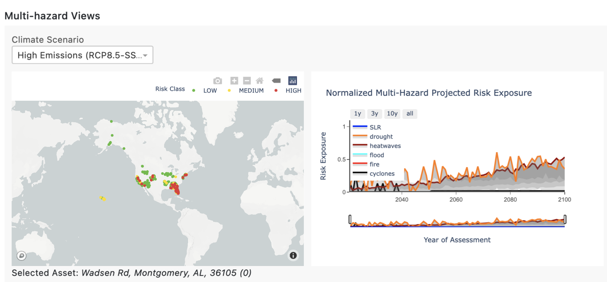

## FAQs

### General Questions

**Q:** What time period does your historic observation dataset cover?

**A:** Our historic observation datasets cover the period from Jan 2010 to Dec 2020.

**Q:** What time period does your forward looking projected outcome dataset cover?

**A:** Our forward looking projected outcomes assess the period from 2022 to 2100.

**Q:** What geographies does your dataset include?

**A:** Our capabilities are global. We provide climate scenario analysis over the entirety of the earth’s landmass

**Q:** How does your dataset enable for climate change adaptation?

**A:** Our dataset and analytics enable scenario driven analysis for climate change adaptation. Using our API product or the Climate Explorer dashboard, our customers and partners are enabled with asset-level assessments of climate risk exposure from acute and chronic climate related hazards.

______________________________________________________________________________________________________________

### Hazard Specific Questions

#### Wildfire

**Q:** What are the different data modalities of wildfire?

**A:** The different data modalities include:historic wildfire exposure; forward looking burned area fraction projection ; and forward looking wildfire susceptibility projection. Historic exposure is determined by derivatives from satellite imagery (observations) while forward looking projections are derived from global climate models (GCMs).

**Q:** Why do I see active fires within the dataset, but no projected scenario based fire hazards?

**A:** There are occasionally sites where we see observed active fires and no projected scenario based fire hazard. This could be due to: Human generated fires that are not controlled fires and not wildfires; Limitations of the wildfire projection models; Changing risk exposure.

For more detail:
[1] This could be due to erroneous historic data. The MODIS satellites use temperature to estimate fire prevalence, so other activities that generate fire/heat can appear as wildfire. This includes power plants, gas flares, or prescribed burns.
[2] It could be flaws in CMIP6 models, especially when fires are driven by processes too small-scale for coarse models to capture. Our product should deal with that in most cases, but not all.
[3] Your probability of future risk exposure may also appear as 0 due to shifting land use patterns in the future. Changing vegetation cover due to drying or expanding urbanization can decrease future risk in areas with high historic risk.

**Q:** Which values are relevant when the historic fire data and future projections disagree?

**A:** The historic data will be a better indicator of near-term fire risk but the climate models will be a better indicator of long-term, decadal and multi-decadal fire risk.

**Q:** How do you determine the severity of wildfire risk?

**A:** Historic fire severity is represented by the number of active fires within 10km radius of the asset, scaled to a value between 0 and 1.0    

**Q:** How are controlled burns determined?

**A:** We use satellite derived observations, which means that we cannot determine which fires are human generated vs natural fire. However, controlled burns surface as observed fires in the historic exposure. The forward looking fire exposure across scenarios accounts for controlled burns on agricultural land.

#### Flooding

**Q:** Does historic and projected flooding include both coastal and inland flooding?

**A:** Historic flooding covers inland and coastal flooding. Projected flooding data only covers inland flooding. You can look at the cyclone projections and sea level rise projections as indicators of forward looking coastal flooding.

______________________________________________________________________________________________________________

### Dashboard Questions

**Q:** Why is my hazard HIGH-risk on the risk heat map view, but LOW-risk on the multi-hazard view?

**A:** We take risk values, re-normalize them according to a maximum value, and then apply new thresholds. Therefore,  the risk heat map classifications are not necessarily indicative of multi-hazard classifications. Assets on the risk heat map are labeled (colored) based on the categories of LOW/MEDIUM/HIGH as outlined in our documentation on our developer center. The multihazard heatmap is based on a combined score derived from risk exposure to the asset across all the different hazards.

**Q:** Is the overall severity coloring based on the highest category risk or is it based on the normalization method mentioned in the user guide?

**A:** Overall severity is based on the maximum risk across all hazards, determined by the normalization method described in the user guide.

**Q:** Is asset level loss associated with the highest risk category used for severity coloring, or does it represent overall asset loss estimates for all hazards?

**A:** Asset level risk is based on the estimate of the loss from a specific hazard. The heatmap color indicates the level of exposure across all the assets in the portofolio. The value of the asset is scaled by the level of exposure to determine the estimated loss in the estimated value at risk summary.

**Q:** Is the multi-hazard time series map view based on individual portfolio facility locations or on the multi-view heat map?

**A:** The multihazard time series view on the right hand side of the multi-hazard heatmap is based on the risk exposure to the specific asset selected on the multi-hazard heatmap view. The name of the selected asset is described below the multi-hazard heatmap view.

E.g. in this screenshot above, the asset selected is 3613 Crawfordville, as seen below the map view. The time series graph on the right hand side shows projected risk exposure for that specific asset only.

**Q:** What does the “distribution by type” option for Estimated Value at Risk Summary mean?

**A:** Distribution by type is a grouping of all assets of the same type to create one slice (category). This is based on the aggregated value of estimated loss, determined by the type of assets.

**Q:** Why does the cyclone projection tend to be a flat line beyond the year 2050?

**A:** We provide annual cyclone projections over the years 1980-2050. Beyond the year 2050, we use the mean probability of cyclone projections over the 2030-2050 window for that specific asset location.

______________________________________________________________________________________________________________

### Dataset (CSV) Questions

**Q:** What does the risk exposure file nomenclature mean (e.g., ubd vs lbd)?

**A:** No postfix represents the midpoint value. ‘ubd’ and ‘lbd’ represent upper and lower bound values (usually mapped to the 16th and 84th percentiles from the distribution of simulation runs for climate models for the specific hazard), and are indicative of the values for the gray bars in the time series plot.

**Q:** Why do the historic values of a hazard change with each scenario?

**A:** The historic values of a hazard beginning in 2015 are derived from simulation runs across multiple scenarios. There will be minor variability for the historic years (2015-present) across scenarios.
