## Introduction

This section will go through each risk exposure dataset available for download and explain the methodology behind it. We will also show you how to use and interpret the numbers, which includes a written interpretation of the datasets. Please note that you must change the sections of text in brackets `[  ]` to suit the specific values, hazards and scenarios you are describing.

## What are the CSV datasets?

Comma separated value (CSV) files contain the physical climate risk analysis information from Climate Explorer Dashboard product, which can be used for reporting, risk management and strategic planning needs. Using the CSV files are useful if you would like to use the underlying data to create your own graphs or charts for a report or presentation, to undergo further analysis (such as data aggregations, comparisons between assets etc.) or as an input into your Excel models.

## File naming conventions

Here are the descriptions of the naming parameters:

1. Reporting Data Type {`reporting_data_type`}: This tells you the risk variable the CSV contains data for: annual_temperature, annual_precipitation, cyclones, extreme_precipitation, fire_risk, flood, heatwaves and drought (SPEI), sea level rise (SLR)
2. Dataset Name {`dataset_name`}: This is the name assigned to project or dataset (portfolio) by the customer or Sust Global
3. Scenario ID {`scenarioID`}: This tells you which scenario the data within the CSV file was generated under, and it can be either: ssp126 (Strong Mitigation); ssp245 (Middle of the Road); or ssp585 (High Emissions).
4. Bounds: For some files, this will tell you whether the data presented is the `lbd` (lower bound, which is the 16th percentile), `ubd` (upper bound, which is the 84th percentile), or the `median` (in which case, there will be nothing additional written in the file name at all) outputs from the climate models. The exception is cyclones, which use a different upper and lower bound (+/- 1 standard deviation) and we use the mean, rather than the median, output from the climate models. 

## Historic risk exposure

The naming convention for the historic risk exposure datasets is as follows:
sustglobal_asset_his_risk_{dataset_name}.csv

In these files, each row corresponds to one asset location, and there are individual columns for each month from Jan 2010 to Dec 2020 for Cyclone exposure; each year from 2001 to 2021 for Wildfire; and each year from 2012 to 2021 for Flooding.

#### Interpretation
The example we are looking at here is called `sustglobal_asset_his_risk_MRTG_demo.csv`

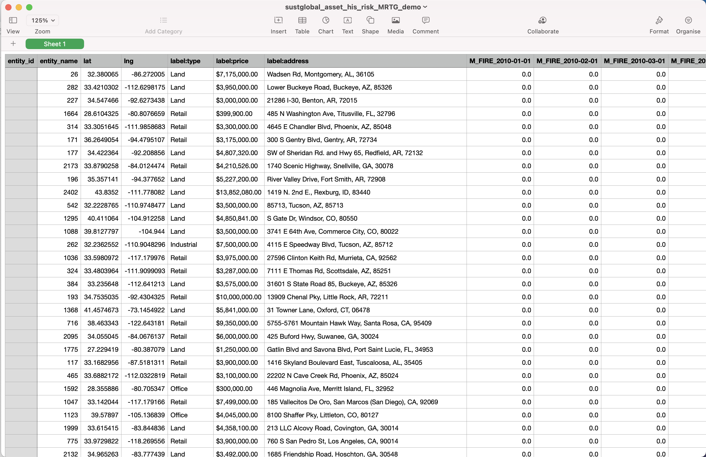

Fig 14: Historical Risk CSV

`M_FIRE_YYYY-MM-DD`: This shows the yearly severity values for observed historical wildfires within 1km of an asset. 
For example, Asset X has a Wildfire historic risk event severity value of [1/0] in [2018]. This means that in [2018], there [was/wasnt] a satellite-observed wildfire within within a 1km radius of asset X.

`FLOOD_YYYY-MM-DD`: This shows the yearly severity values for observed historical inland floods for a specific asset. 
For example, Asset X has a Flood historic risk event severity value of [1/0] in [2018]. This means that in [2018], there [was/wasnt] a satellite-observed flood at the location of of asset X.

`CYCLONE_YYYY-MM-DD`: This shows the monthly severity values for observed historical cyclones for a specific asset. 
For example, Asset X has a Cyclone historic risk event severity value of [1] in [Sep 2017]. This means that there was [one] Category 3, 4 or 5 cyclone observed in September 2017 within a 241km radius of Asset X.

## Forward looking risk exposure

The naming convention for the CSV files is as follows: `sustglobal_asset_fwd_{reporting_data_type}_risk_{dataset_name}_{scenarioID}. csv` 
In every dataset CSV, each row corresponds to an asset in the data collection. We have columns for the individual asset attributes and a column for each year from 1980 to 2100. The columns for each year contain the projected risk value for a specific asset for a specific year based on the reporting outcomes description.
Refer to the User Guide section ‘Uploading a portfolio’ for more information on the input fields, such as lat, lng and address. We will explain each of the output fields in turn below.

Please note that each of the forward looking dataset CSVs will include projections for past years (1980 onwards) - these are climate model outputs incorporated into our proprietary machine learning techniques used to validate our data. We would advise using the forward looking projections only, and use the historical datasets for risk values from previous years.

### Forward looking annual precipitation datasets
This section will look at CSVs with the Reporting Data Type {reporting_data_type} of `annual_precipitation`: `sustglobal_asset_fwd_annual_precipitation_risk_{dataset_name}_{ScenarioID}.csv`

In this example, we will look at the following dataset:
`sustglobal_asset_fwd_annual_precipitation_risk_MRTG_demo_ssp126_lbd.csv`

This dataset shows the forward looking annual precipitation for assets in a selected portfolio, under an ssp126 scenario (Strong Mitigation), and shows the lower bound of the climate model outputs.

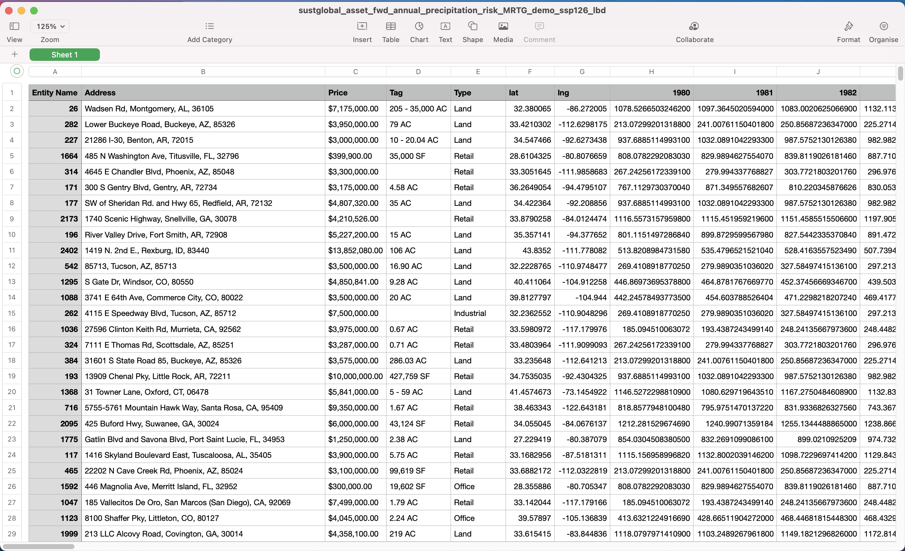

Fig 15: forward looking annual precipitation CSV

#### Interpretation of YYYY column

The values in these columns show the [lower bound] of the projected annual precipitation values for a specific asset under the [Strong Mitigation] scenario.

### Forward looking annual temperature datasets

This section will look at CSVs with the Reporting Data Type {reporting_data_type} of `annual_temperature`: `sustglobal_asset_fwd_annual_temperature_risk_{dataset_name}_{ScenarioID}.csv`

In this example, we will look at the following dataset:
`sustglobal_asset_fwd_annual_temperature_risk_MRTG_demo_ssp126_lbd.csv`

This dataset shows the forward looking annual temperature for assets in a selected portfolio, under an ssp126 scenario (Strong Mitigation), and shows the lower bound of the climate model outputs.

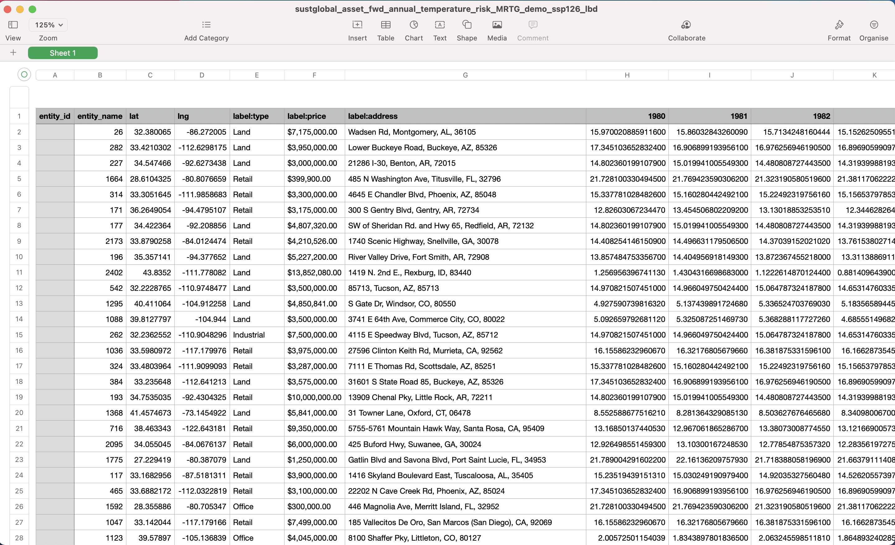

Fig 16: forward looking annual temperature CSV

#### Interpretation of YYYY column
The values in these columns show the [lower bound] of the projected annual temperature values for a specific asset under the [Strong Mitigation] scenario.

### Forward looking extreme precipitation datasets

This section will look at CSVs with the Reporting Data Type {reporting_data_type} of `extreme_precipitation`: `sustglobal_asset_fwd_extreme_precipitation_risk_{dataset_name}_{ScenarioID}.csv`
In this example, we will look at the following dataset:
`sustglobal_asset_fwd_extreme_precipitation_risk_MRTG_demo_ssp126.csv`

This dataset shows the forward looking median annual extreme precipitation for the selected portfolio, under an ssp126 scenario (Strong Mitigation).

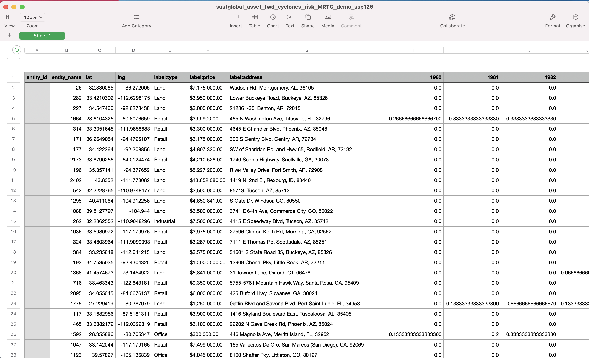

Fig 18: forward looking extreme precipitation CSV

#### Interpretation of YYYY column
The values in these columns show the median projected annual extreme precipitation values for a specific asset under the [Strong Mitigation] scenario.

### Forward looking cyclone datasets

This section will look at CSVs with the Reporting Data Type {reporting_data_type} of `cyclones`: `sustglobal_asset_fwd_cyclones_risk_{dataset_name}_{ScenarioID}.csv`
In this example, we will look at the following dataset: `
sustglobal_asset_fwd_cyclones_risk_MRTG_demo_ssp126.csv`

This dataset shows the forward looking annual cyclone risk for the selected portfolio, under an ssp126 scenario (Strong Mitigation), and shows the mean of the climate model outputs.

Fig 17: forward looking cyclone risk CSV

#### Interpretation of YYYY column
The values in these columns show the [mean] of the projected annual cyclone risk for a specific asset in a particular year under the [Strong Mitigation] scenario. For example, Asset X has a Tropical Cyclone risk projection value of [0.5] in [2045]. This means that in [2045], we project a [50]% probability of at least one hit by a category 3/4/5 cyclone within a 241km radius of the asset under the [Strong Mitigation] scenario.

### Forward looking unified wildfire datasets
This section will look at CSVs with the Reporting Data Type {reporting_data_type} of `wildfire_unified_prob`: `
sustglobal_asset_fwd_wildfire_unified_prob_risk_{dataset_name}_{ScenarioID}.csv`
 
In this example, we will look at the following dataset:
`sustglobal_asset_fwd_wildfire_unified_prob_risk_MRTG_demo_ssp126.csv`

This dataset shows the forward looking median annual unified wildfire risk for the selected portfolio, under an ssp126 scenario (Strong Mitigation).

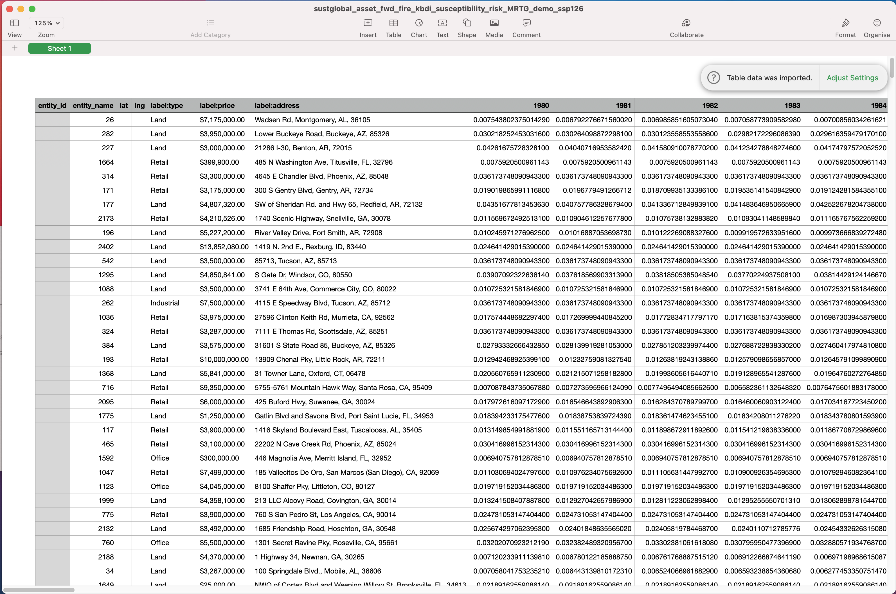

Fig 19A: forward looking Unified wildfire risk CSV

#### Interpretation of YYYY column
The values in these columns show the median projected annual Wildfire Susceptibility values for a specific asset under the [Strong Mitigation] scenario.

For example, Asset X has a wildfire probability risk projection value of [0.05] in [Jan, 2023]. This means that in the year [2023], we project a [5]% probability of a wildfire occurring within 1km of the asset under the [Strong Mitigation] scenario.

### Forward looking flood risk datasets

This section will look at CSVs with the Reporting Data Type {reporting_data_type} of `flood`: `sustglobal_asset_fwd_flood_risk_{dataset_name}_{ScenarioID}.csv`
 
In this example, we will look at the following dataset: `sustglobal_asset_fwd_flood_risk_MRTG_demo_ssp126.csv`
This dataset shows the forward looking median annual Inland Flooding risk for the selected portfolio, under an ssp126 scenario (Strong Mitigation).

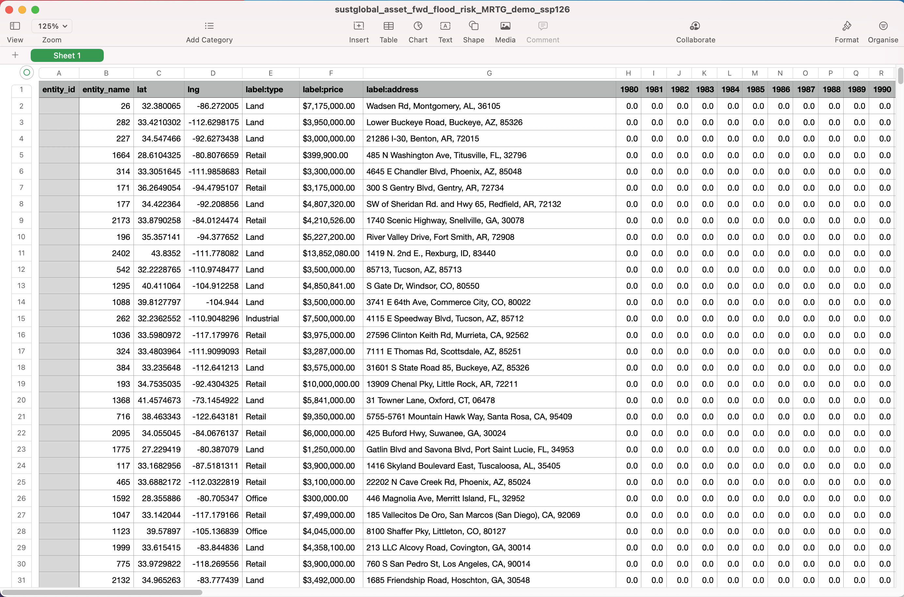

Fig 21: forward looking Inland Flooding risk CSV

#### Interpretation of YYYY column

The values in these columns show the median projected annual Inland Flooding risk values for a specific asset under the [Strong Mitigation] scenario.

For example, Asset X has an Inland Flooding risk projection value of [0.1] in [Jan, 2023]. This means that in the year [2023], we project a [10]% probability of exposure to a flood under the [Strong Mitigation] scenario.

### Forward looking heatwave risk datasets
This section will look at CSVs with the Reporting Data Type {reporting_data_type} of `heatwaves`:  `sustglobal_asset_fwd_heatwaves_risk_{dataset_name}_{ScenarioID}.csv`

 
In this example, we will look at the following dataset: `sustglobal_asset_fwd_heatwaves_risk_MRTG_demo_ssp126.csv`
This dataset shows the forward looking median annual Heatwave risk for the selected portfolio, under an ssp126 scenario (Strong Mitigation).

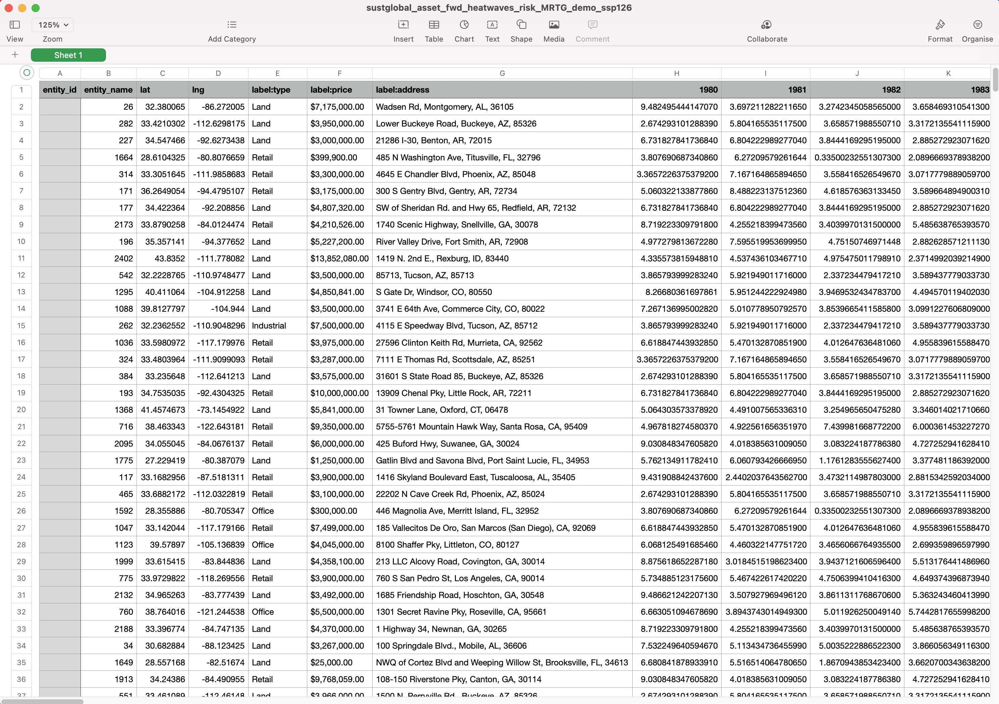

Fig 22: Forward Looking Heatwave risk CSV

#### Interpretation of YYYY column 
The values in these columns show the median projected annual Heatwave risk values for a specific asset under the [Strong Mitigation] scenario.

For example, Asset X has a Heatwave risk projection value of [108] in [Jan, 2023]. This means that in the year [2023], we project [108] heatwave days under the [Strong Mitigation] scenario.

### Forward looking sea level rise (SLR) risk datasets
This section will look at CSVs with the Reporting Data Type {reporting_data_type} of `sea level rise`: `sustglobal_asset_fwd_SLR_risk_{dataset_name}_{ScenarioID}.csv`
In this example, we will look at the following dataset: `sustglobal_asset_fwd_SLR_risk_MRTG_demo_ssp126.csv`
This dataset shows the forward looking median annual SLR risk for the selected portfolio, under an ssp126 scenario (Strong Mitigation).

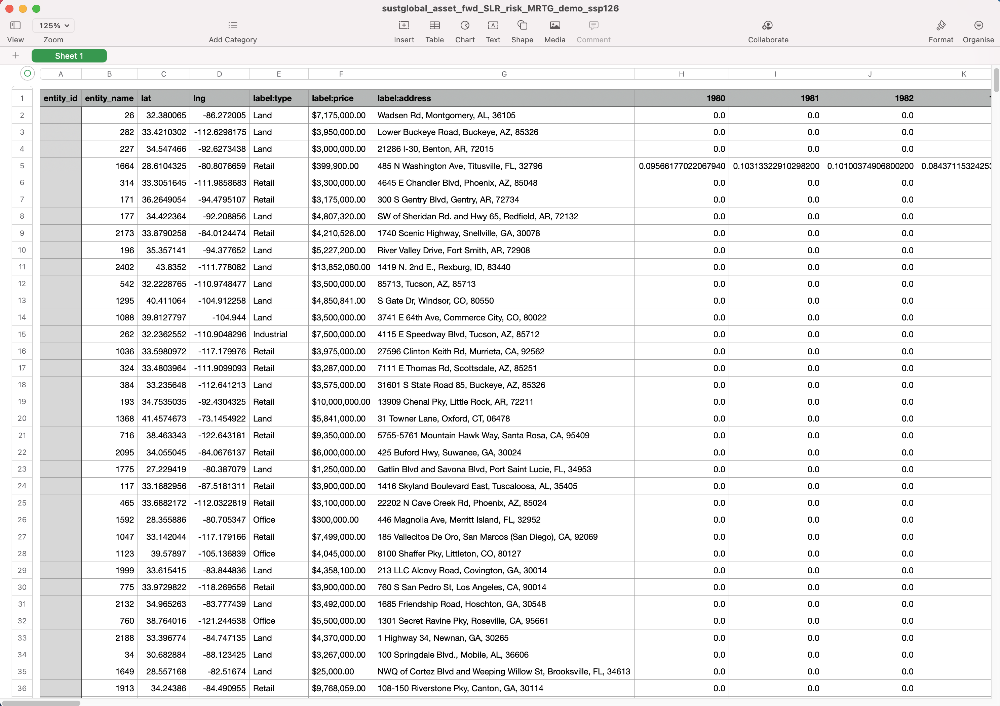

Fig 23: Forward Looking sea level rise risk CSV

#### Interpretation of YYYY column
The values in these columns show the median projected annual Sea Level Rise risk values for a specific asset under the [Strong Mitigation] scenario.

For example, Asset X has a Sea Level Rise risk projection value of [0.3] in [Jan, 2023]. This means that in the year [2023], we project that the sea level rise will be [0.3] meters above the average historic sea level rise from 1980-2010 under the [Strong Mitigation] scenario. 

### Forward looking drought (SPEI) risk datasets
This section will look at CSVs with the Reporting Data Type {reporting_data_type} of `Standardized Precipitation-Evapotraspiration Index (SPEI)`: `  sustglobal_asset_fwd_SPEI_risk_{dataset_name}_{ScenarioID}.csv`
In this example, we will look at the following dataset: `sustglobal_asset_fwd_SPEI_risk_MRTG_demo_ssp126.csv`
This dataset shows the forward looking median annual Drought risk for the selected portfolio, under an ssp126 scenario (Strong Mitigation).

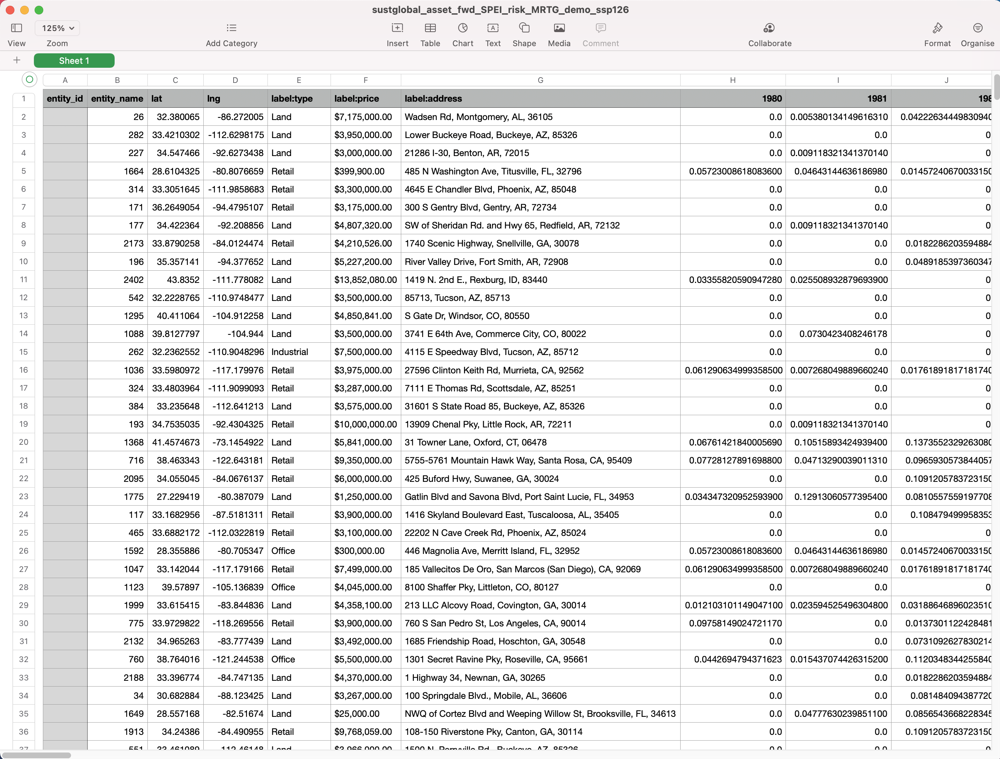

Fig 24: Forward Looking Drought (SPEI Index) risk CSV

#### Interpretation of YYYY column
The values in these columns show the median projected annual Drought risk values for a specific asset under the [Strong Mitigation] scenario.
For example, Asset X has a Drought risk projection value of [0.8] in [Jan, 2023]. This means that in the year [2023], we project that the rescaled SPEI index will have a value of [0.8] under the [Strong Mitigation] scenario.

The Drought indicator is a rescaled version of the drought (SPEI) index, meaning that values fall between an easy to interpret 0 to 1 range. Index values of 1.0 indicate that the drought exposure is high, at unprecedented levels relative to the 1950 to 2014 historical period, and values of 0.0 indicate no drought exposure.

### Forward looking water stress score datasets

This section will look at CSVs with the Reporting Data Type {reporting_data_type} of `waterstressscore`: `sustglobal_asset_fwd_waterstressscore_risk_{dataset_name}_{ScenarioID}.csv`
In this example, we will look at the following dataset: `sustglobal_asset_fwd_waterstressscore_risk_MRTG_demo_ssp126.csv`
This dataset shows the forward looking median annual Water Stress Scores for the selected portfolio, under an ssp126 scenario (Strong Mitigation).

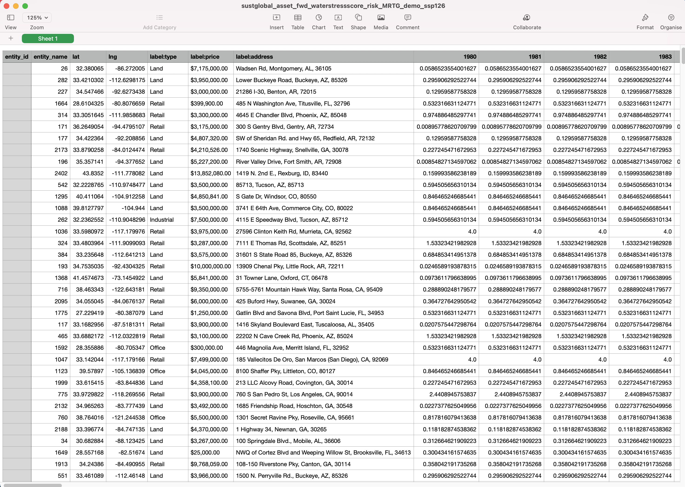

Fig 25: Forward Looking Water Stress Score risk CSV

#### Interpretation of YYYY column 
The values in these columns show the median projected annual Water Stress Score risk values for a specific asset in a particular year under the [Strong Mitigation] scenario.

For example, Asset X has a Water Stress Score risk projection value of [0.1] in [Jan, 2023]. This means that in the year [2023], we project that the annual ratio of water demand to renewable water availability will be 4 under the [High Emissions] scenario. 

A score of 0.0 indicates that there is no water stress, and a score of 4.0 indicates extreme water stress. The World Resources Institute set the threshold of 0.4 as ‘High’ based on existing scientific literature and expert judgment, but there is inherently a degree of subjectivity in defining thresholds. If you are interested in reading more, see section 5.1 of the [WRI Aqueduct documentation](https://files.wri.org/d8/s3fs-public/Aqueduct_Global_Maps_2.1-Constructing_Decicion-Relevant_Global_Water_Risk_Indicators_final_0.pdf). 

### Forward looking unified water stress score datasets

This section will look at CSVs with the Reporting Data Type {reporting_data_type} of `water_stress_unified_score`: `sustglobal_asset_fwd_water_stress_unified_score_risk_{dataset_name}_{ScenarioID}.csv`
In this example, we will look at the following dataset: `sustglobal_asset_fwd_water_stress_unified_score_risk_MRTG_demo_ssp126.csv`
This dataset shows the forward looking median annual Water Stress Scores for the selected portfolio, under an ssp126 scenario (Strong Mitigation).

Fig 25A: Forward Looking Unified Water Stress Score risk CSV

#### Interpretation of YYYY column 
The values in these columns show the median projected annual unified water stress score risk values for a specific asset in a particular year under the [Strong Mitigation] scenario that unified exposure to drought and water stress.

For example, Asset X has a Unified Water Stress Score risk projection value of [0.1] in [Jan, 2023]. This means that in the year [2023], we project a [0.1] percent probability of water stress from drought, water consumption and water availability patterns under the [High Emissions] scenario. 

A score of 0.0 indicates that there is no water stress, and a score of 1.0 indicates extreme water stress. The World Resources Institute set the threshold of 0.4 as ‘High’ based on existing scientific literature and expert judgment, but there is inherently a degree of subjectivity in defining thresholds. If you are interested in reading more, see section 5.1 of the [WRI Aqueduct documentation](https://files.wri.org/d8/s3fs-public/Aqueduct_Global_Maps_2.1-Constructing_Decicion-Relevant_Global_Water_Risk_Indicators_final_0.pdf). 

### Forward looking summary labels datasets
This section will look at CSVs with the Reporting Data Type {reporting_data_type} of `risk_summary_labels`. `sustglobal_asset_risk_summary_labels_{dataset_name}_{window}_{ScenarioID}.csv`
In this example, we will look at the following dataset:`
sustglobal_asset_risk_summary_labels_MRTG_demo_15yr_ssp126.csv`
This dataset shows the risk summary labels for the selected portfolio for the next 15 years, under an ssp126 scenario (Strong Mitigation).

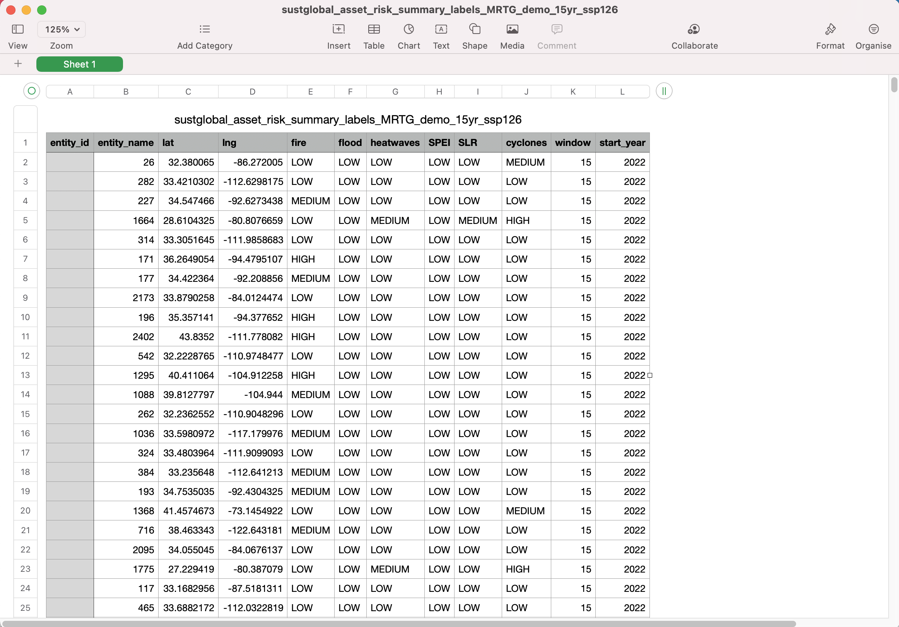

Fig 26: summary labels CSV

This dataset shows the forward-looking risk classification for each asset across all the hazards. We look at the maximum risk exposure to a specific hazard for an asset over the specified time horizon, and use this to categorize the asset as LOW, MEDIUM, or HIGH risk.

Please note that the `window` field refers to the time horizon, which is 15 years in this case. `window` can have a value of 5 years, 15 years or 30 years. 

#### Methodology
For a selected scenario (SSP), we would look at the maximum value of risk exposure over the 30 year time window for all hazards, for each asset. 

We look at the maximum risk exposure value across the 30 year time horizon for all hazards, with the exception of sea level rise (SLR) and 2021-2100 for SLR as the input to the risk summary view.
For a specific asset, we would look at the maximum risk value per year, across each hazard.
For each hazard, we then identify the maximum risk exposure value of each asset over all the years in the analysis time window and use that value as input to a classification of LOW, MEDIUM or HIGH. Note that for drought (SPEI), we would use the rescaled values which fall between an easy to interpret 0 to 1 range, reaching index values of 1.0 if the drought exposure are at unprecedented levels relative to the 1950 to 2014 historical period and value of 0.0 indicating no drought exposure. For flooding, we use the number of years within a 30-year period where the risk exceeds a preset threshold (5%). This is to simulate a flood exceedance threshold from the flood exposure values. Maximum exposure values per hazard are listed in the table in the [Data Guide](./dataguide.html).

### Forward looking summary score datasets
This section will look at CSVs with the Reporting Data Type {reporting_data_type} of `risk_summary_scores`: `sustglobal_asset_risk_summary_scores_{dataset_name}_{window}_{ScenarioID}.csv`
In this example, we will look at the following dataset: `sustglobal_asset_risk_summary_scores_MRTG_demo_15yr_ssp126.csv`
This dataset shows the risk summary labels for the selected portfolio for the next 15 years, under an ssp126 scenario (Strong Mitigation).

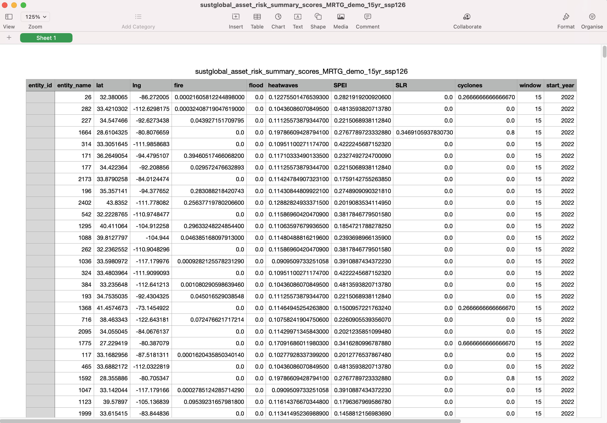

Fig 27: summary scores CSV

Please note that the `window` field refers to the time horizon, which is 15 years in this case. `window` can have a value of 5 years, 15 years or 30 years. 
This dataset shows maximum forward-looking risk exposure to a specific hazard for an asset over the specified time horizon. These numbers are used to categorize the asset as LOW, MEDIUM, or HIGH risk (as seen in the summary labels CSV dataset).

## Financial Risk
The naming convention for the historic risk exposure datasets is as follows:
`sustglobal_asset_{impact_type}_{dataset_name}_{ScenarioID}.csv`, where `impact_type` can be either `financial_risk`, corresponding to the risk of structural damage to an asset in terms of a percentage of an assets total value, or `business_interrpution`, corresponding to the risk of lost business income in terms of days of business interruption.

In these files, each row corresponds to one asset location, and the columns correspond to the expected percent annual Value-at-Risk.  These include information on `cyclones`, `wildfire`, `floods` and `heatwaves`, for `baseline`, `2030`, `2050`, and `2080`.

