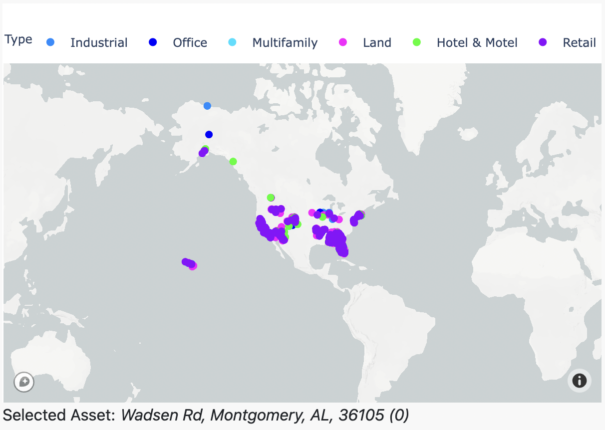
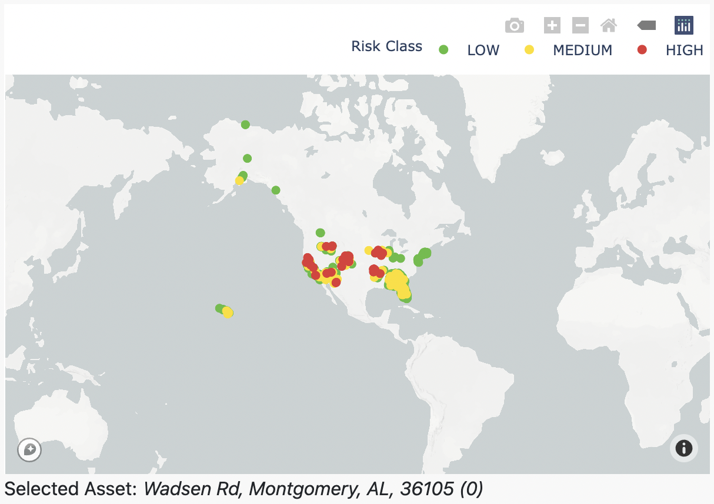
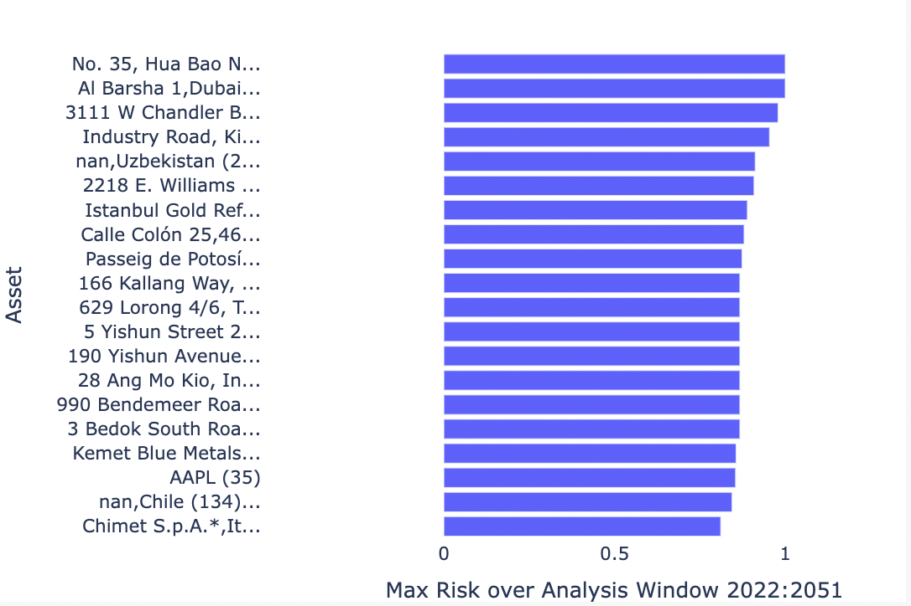
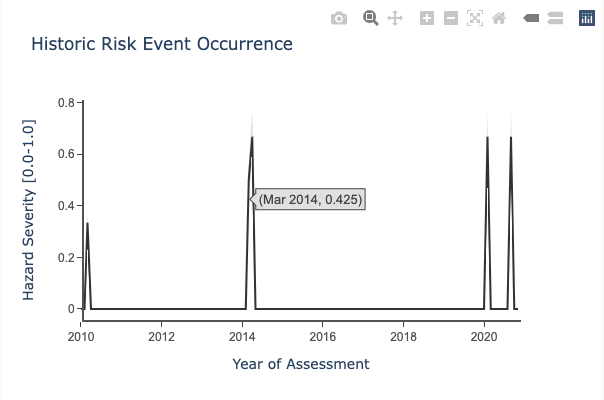
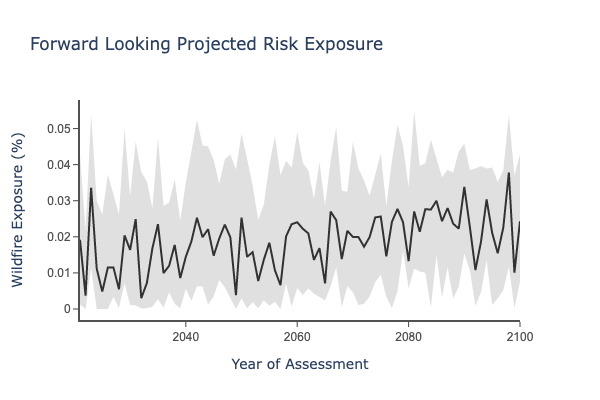
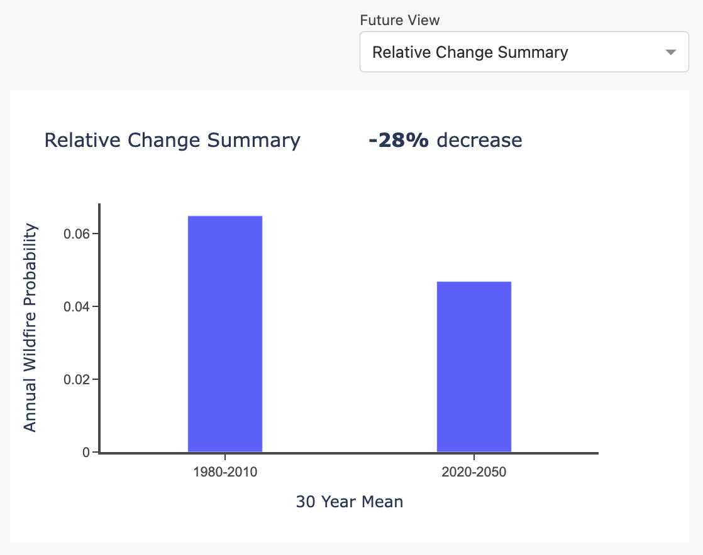
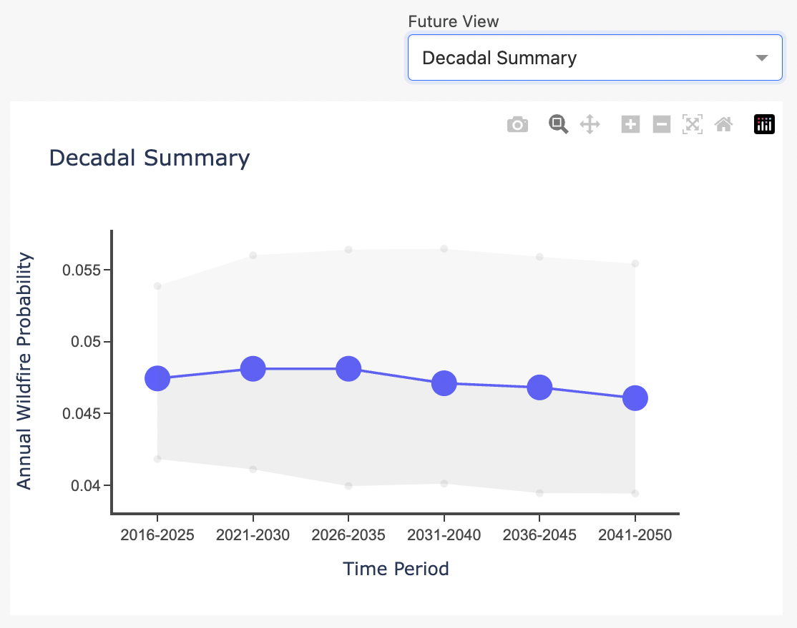
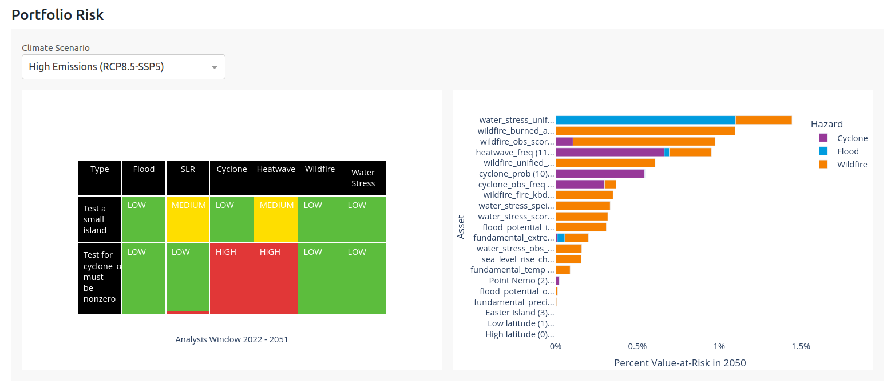
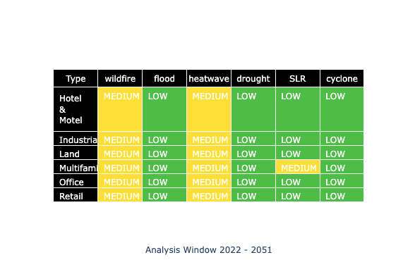
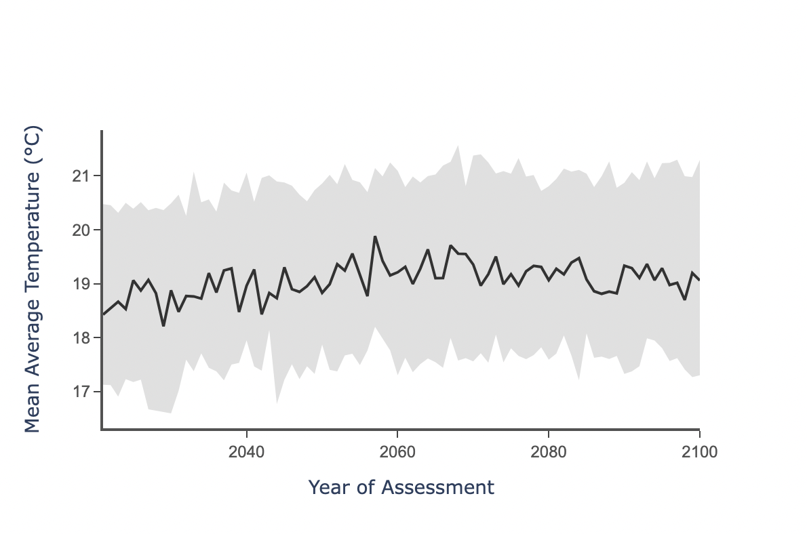

**Introduction**
The tmpdatest Climate Explorer dashboard is intended as a simple view on asset and regional risk exposure.  It showcases projected and historic risk exposure, Value at Risk, and fundamental climate variables.  

This document goes through the different panels and graphics on the dashboard, and explains the datasets behind it. It should be read in conjunction with the [Data Guide](./dataguide.html).

## Scenario-based Exposure Summaries

The top-left view on the Climate Explorer dashboard provides an overview of asset-level risk exposure.  It has controls to select Climate Scenario, Historic Hazard, and Project Hazard, and it includes 4 graphs:
- Asset Map
- Riskiest Assets
- Historic Risk Event Occurrence
- Projected Risk Exposure

### Asset Map
The top-left graphic shows all the assets for the selected portfolio in a map view. This view can be set to show categorical `Asset Type` (if supplied with the portfolio CSV), as well as a graduated `Risk Heatmap` (High, Medium, and Low).

<p align="center">

</p>

<p align="center">
<b>Fig 1:</b> Asset Type
</p>

<p align="center">

</p>

<p align="center">
<b>Fig 2:</b> Risk Heatmap
</p>

The map also acts as a selection controller for the other graphs on this section of the dashboard.  Selecting a specific asset on the map updates the other graphs to show information about that asset. You can check which asset is selected by looking below the map at the address written. In this case, the selected asset is Wadsen Rd, Montgomery, AL, 36105, and it is the 0th asset in the input portfolio CSV.

**Asset Type**
When hovering over a specific asset you can see its data attributes, including the address, type, coordinates and index value. The top bar displays the legend, where each color indicates a specific asset type. Asset types can be manually changed to suit your needs. In this example, they show the different types of real estate, such as industrial, office or multifamily buildings. However, you could change this to be countries or cities, and this is done by creating a column called `label:type` in the input portfolio CSV and supplying values for each asset. Refer to the User Guide section ```Uploading a portfolio``` for more information on this.

**Risk Heatmap** 
For a selected `Climate Scenario` and `Projected Hazard`, we show categorical risk, using the maximum value of risk exposure over a projected time window:
1. We use a 30 year window (2023-2052) for each hazard. For sea level rise we use a 2023-2100 window to account for sea level rises longer-term profound impacts.
2. We use the maximum risk exposure value of each asset over all the years in the analysis time window. 
3. We create categories using this maximum risk exposure, to classify each asset as Low, Medium, or High risk.  Each hazard has specific classification breakpoints, which are derived from a representative sample of global risk.  Risk categories are listed in the [Data Guide](./dataguide.html). 

### Riskiest Assets

The top-right Climate Explorer bar chart shows the top 20 assets in a portfolio with greatest risk exposure over a 30 year time horizon (2023-2052). It also controlled by the selected `Projected Hazard` and `Climate Scenario` dropdowns.

<p align="center">

</p>

<p align="center">
<b>Fig 3:</b> Riskiest 20 assets within a portfolio
</p>

This view allows you to quickly view assets that are most at-risk, and prioritize deeper investigation accordingly.  Check the units for the x-axis by looking at the Indicator metadata table in the [Data Guide](./dataguide.html). For a selected `Climate Scenario` and `Projected Hazard`, we show categorical risk, using the maximum value of risk exposure over a projected time window:
1. We use a 30 year window (2023-2052) for each hazard. The exception is sea level rise, for which we use a 2023-2100 window to account for sea level rises longer-term profound impacts.
2. We use the maximum risk exposure value of each asset over all the years in the analysis time window. 

### Historic Risk Event Occurrence

This view shows the observed historic monthly risk event occurrence for a particular asset to a particular hazard, using available satellite observations.

<p align="center">

</p>

<p align="center">
<b>Fig 4:</b> Historic event occurrence
</p>

Use the `Historic Hazard` dropdown to toggle between the different hazards. Please note that we currently offer observed historical data on wildfire, flooding, cyclones and water stress. 

Check the units for the y-axis by looking at the table in the [Data Guide](./dataguide.html) for the appropriate hazard. You can select a different asset using the map, which will change the historic time series.

### Projected Risk Exposure

This view shows the projected annual risk exposure for a particular asset.  Use the `Projected Hazard` dropdown to toggle between the different hazards and this will change the graph. You can learn more about the units for the y-axis by looking at the table in the [Data Guide](./dataguide.html). The selected asset is shown below  the selection map. You can select a different asset by clicking on that map, which will update the projected exposure graph.

**Annual Time Series**
The default view for this graph is a timeseries of annual risk, projected to the year 2100.  The central timeseries presented is the median of outputs from the climate models. The gray bounds represent the uncertainty of the climate model outputs.  For more information on model uncertainty, see the [Data Guide](./dataguide.html).

It's important to use single-year values with caution.  No model can accurately predict the exact risk in a particular future year.  Annual time series should generally be used to construct aggregations, such as 10, 20, or 30 year risk averages.

<p align="center">

</p>

<p align="center">
<b>Fig 5:</b> Forward-looking annual time series
</p>

**Relative Change Summary**
This view shows the percent difference in risk, comparing the historic vs future climate.


<p align="center">

</p>

<p align="center">
<b>Fig 6:</b> Relative change summary, Historic vs Future Risk
</p>

**Decadal Summary**
This view is similar to the Annual Time Series, but expressed as a rolling average between 2016 and 2050.  This is a better view for understanding risk, as single year values can be misleading.


<p align="center">

</p>

<p align="center">
<b>Fig 7:</b> Moving averages over a decadal window, 2016-2050.
</p>

## Financial Risk Analysis
### Asset Map

This view is another Asset Type map which can be used to select assets for visualizing Value-at-Risk in the graph to the right.

<p align="center">

</p>

<p align="center">
<b>Fig 8:</b> Asset Type map
</p>

### Value at Risk

This view describes asset-level Value-at-Risk for cyclones, floods, and wildfires.  It allows users to easily visalize the annual expected loss from exposure to physical perils, and to see how this risk changes in the future.  Results are shown for historic, near-term (2030), mid-term (2050) and long-term (2080).  For more information on the methodology behind Value-at-Risk, see the [Data Guide - Value at Risk](./var.html).

<p align="center">

</p>

<p align="center">
<b>Fig 9:</b> Annual Expected Value-at-Risk
</p>

## Portfolio Risk
### Tabular Portfolio Risk by Asset Type

This view provides a summary of the forward looking risk exposure across different hazards for each of the asset types. It is essentially a tabular view of the Risk Heatmap, aggregated by asset type.

<p align="center">

</p>

<p align="center">
<b>Fig 10:</b> Portfolio Summary Risk Table
</p>

The risk summaries are based on the average values of exposure across all assets of a specific type. Asset types can be manually changed to suit your needs. In this example, they show the different types of real estate, such as industrial, office or multifamily buildings. Any values provided will be aggregated on, and can be supplied via a `label:type` in the input portfolio CSV, and including values for each asset. Refer to the User Guide section `Uploading a portfolio` for more information on this.

The summary risk values change if you toggle between the different scenarios by using the `Climate Scenario` dropdown.

**Risk Heatmap** 
For a selected `Climate Scenario`, we use the mean over asset type, maximum over a projected time window:
1. Within assets of a type, we take the mean risk value at each year. We use a 30 year window (2023-2052) for each hazard. For sea level rise we use a 2023-2100 window to account for sea level rises longer-term profound impacts.
2. We use the maximum risk exposure value of each asset type over all the years in the analysis time window. 
3. We create categories using this maximum risk exposure, to classify each asset as Low, Medium, or High risk.  Each hazard has specific classification breakpoints, which are derived from a representative sample of global risk.  Risk categories are listed in the [Data Guide](./dataguide.html). 


### Riskiest Assets by Value-at-Risk

The top-right Climate Explorer bar chart shows the top 20 assets in a portfolio with greatest physical financial risk over a 30 year time horizon (2023-2052). It provides a way to easily view high priority assets, and prioritize deeper investigation.  For more information, see the [Data Guide - Value at Risk](./var.html).  This view is in contrast to the topmost Riskiest Assets view, which shows exposure without considering financial valuations of risk.

<p align="center">

</p>

<p align="center">
<b>Fig 11:</b> Annual Expected Value-at-Risk, broken down by contribution from each hazard.
</p>


## Climate Variables

### Map your portfolio asset locations

This view is another Asset Type map which can be used as a controller for the temperature and precipitation time series to the right.

<p align="center">

</p>

<p align="center">
<b>Fig 12:</b> Temp/Precip Asset Type map controller
</p>

This is an interactive graphic which shows all the assets for the selected portfolio on a map. This view remains consistent across all the different scenarios and hazards, as it only shows asset locations and not risk.

It also acts as a ‘controller’ for the temperature and precipitation time series to the right on the dashboard - if you click on a specific asset on the map, the time series graphs on the dashboard will change to show the data for that specific asset location. You can check which asset is selected by looking below the map at the address written: in this case, the selected asset is Wadsen Rd, Montgomery, AL, 36105, and it is the 0th asset in the input portfolio CSV.

When hovering over a specific asset, you can see the data attributes for the specific asset, including the address, type, coordinates and index value. 

### Temperature and Precipitation time series

This time series view shows the projected fundamental climate variables over different selected scenarios. 

<p align="center">

</p>

<p align="center">
<b>Fig 13:</b> Temperature time series
</p>

We offer projections of annual temperature, annual precipitation, and extreme precipitation, each of which can be selected by using the `Risk Variable` dropdown. You can also switch between the scenarios by using the `Climate Scenario` dropdown.

You can check which asset is selected by looking below the map to the left on the dashboard, the asset type map, and see which address is written. You can select a different asset by clicking on that map, and this will change the projected time series graph.

The black time series line indicates the mean value of that variable for the specified asset at that point in time, and the gray band around indicates the uncertainty of the forward looking projections. For more information on model uncertainty, see the [Data Guide](./dataguide.html).


