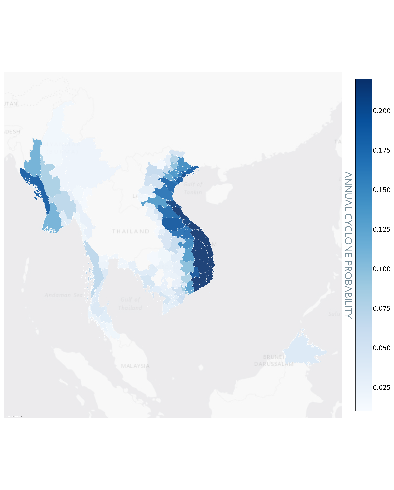
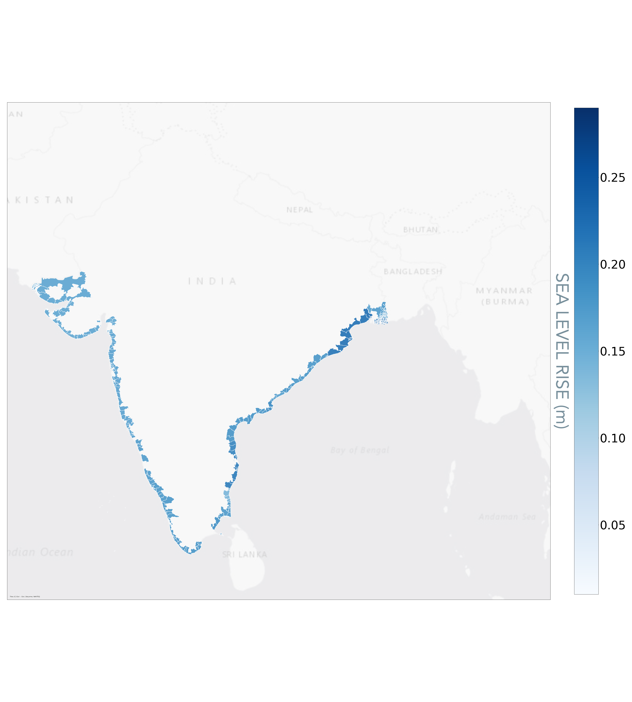

## Introduction
This Data Guide will provide you with an introduction to Sust Global’s data capabilities. We will provide an overview of climate scenarios and our data specification and capabilities. We will introduce you to climate analytics on each of the hazards and show how they can be used to generate business intelligence insights, and also list some measures you can take to adapt and mitigate climate risk.

The world needs validated Climate Analytics. Without data that is consistently validated and objectively true, business decision-making becomes murky, disclosures and reporting become meaningless and managing for the changing climate becomes impossible.

Sust Global's mission is to enable leading businesses with the Climate analytics required to make strategic decisions in our ever-changing world. We take comprehensive measures to ensure data is validated, objectively true, and precise, so you can focus on your work. Sust Global enables users to access asset level,property level or portfolio level Climate Analytics for physical risk assessments across forward-looking time horizons and multiple climate scenarios. 

Our Climate Analytics covers risk from multiple perils: wildfire, flood, cyclone, heatwave, sea level rise and water stress. Through data transformations on ensembles of frontier General Circulation Models (GCMs), asset-level risk exposure is delivered as a time series for each specific asset. Using the latest satellite and sensor observations, we bias-correct the projections from the model ensembles to account for the most recent risk exposure observations. Asset level or regional processing – in conjunction with near real-time observation ingestion with artificial intelligence driven resolution enhancement, served using a scalable cloud-native data platform – allows our users to investigate risk exposure across small or large collections of assets or properties or regions. 

**Data Validation**: For every hazard, we derive asset level exposure data from forward looking indicators based on models from frontier climate science. We benchmark and validate data from these indicators on their hindcast (projections over historic time periods) against observations to qualify the most performant functional models used in our model ensembles.

## Climate Scenarios
Sust Global covers climate scenario analysis following climate scenario definitions set forth from the Intergovernmental Panel for Climate Change - Coupled Model Intercomparison Project-Phase 6 [IPCC CMIP6](https://www.carbonbrief.org/explainer-how-shared-socioeconomic-pathways-explore-future-climate-change/). The IPCC AR6/CMIP6 combines frontier climate science from world leading scientific institutions with realistic climate scenario modeling. The IPCC has finalized the third part of the Sixth Assessment Report, Climate Change 2022: Mitigation of Climate Change on 4 April 2022. Climate scenarios can be thought of as a bundling of working hypotheses on the evolution of human development over the coming years. 

This guide covers the exposure of climate related hazards relating to three distinct climate scenarios:
1. **Strong Mitigation**: This scenario covers the optimal sustainable path, also referred to as the Green Road (SSP1-RCP2.6). It encompasses socioeconomic and representative emissions pathways consistent with a gradual and pervasive global shift towards a more sustainable future. Carbon emissions begin to decline around 2020 and global mean temperatures rise approximately 1.8°C by 2100, a key goal of the Paris Climate Agreement.
2. **Middle of the Road**: This scenario covers a middle path, with challenges to climate mitigation (SSP2-RCP4.5). In this scenario, environmental systems experience degradation, and climate change worsens through the end of the century. In this scenario, overall emissions continue to rise through mid-century before beginning to decline.This is a likely scenario if governments and policy reflect a strong sense of urgency towards climate adaptation. Global mean temperatures rise approximately 2.4°C by 2100, but greater emissions raise the risk of tipping points.
3. **High Emissions**: This scenario covers a future where the world continues on its current trajectory, also referred to as Fossil-Fueled Growth (SSP5-RCP8.5). Global markets are increasingly integrated and both total population and per-capita consumption increase. Emissions peak around 2090 and global mean temperatures rising approximately 4.3°C by 2100.

Sust Global’s data product provides asset level exposure to specific climate related hazards. In the following sections, we will cover descriptions of each of the hazards covered. Climate Explorer, Sust Global’s dashboard product provides asset level exposure insights to specific hazards. These insights are presented as time series, summary heatmaps across a portfolio of assets and sorting of assets based on their exposure to a specific hazard.

## Wildfire

### Description

Wildfire is an uncontrolled fire, caused by a combination of combustible fuels (such as dead, dry wood) and ignition sources (such as human activity or lightning).  It is strongly influenced by prevailing weather conditions, and typically occurs where human activity meets an accumulation of wild fuel.

### Sample Assessment

Fig D1: United States Counties, Projected mean annual wildfire risk exposure over 1980-2010 and 2022-2052 with SSP5-RCP8.5 scenario.

| State | County Name | Score (1980-2020) | Score (2022-2052) | Percent Change | 
| - | - | - | - | - |
| Idaho | Custer |0.0336 | 0.0819 |143.7490 |
| California | Colusa | 0.073 |	0.0811	|11.1143 |
| California | Glenn | 0.0618	|0.0716| 15.8886 |
| Deer Lodge | Montana | 0.0218 | 0.0590 | 	170.1383 |
| Valley | Idaho | 0.0296 | 0.0542 | 83.2560 |

Table 1A: US Counties with top wildfire exposure projected over upcoming 30 years

Fig D2: Indian towns, projected mean annual wildfire risk exposure over 1980-2010 and 2022-2052 with SSP5-RCP8.5 scenario.

| Region Name | Score (1980-2020) | Score (2022-2052) | Percent Change | 
| - | - | - | - | 
| Bastar | 0.1514 | 0.0827 | -45.385 |
| Bijapur | 0.1259| 0.0707| -43.805 |
| Dantewada | 0.1004 | 0.0750 | -25.25 |
| Garhchiroli | 0.1493 | 0.0775 | -48.047 |
| Kondagaon | 0.1005| 0.0693 | -31.055 |

Table 1B: Indian towns with top wildfire exposure projected over upcoming 30 years

### Indicators

We present 4 indicators for wildfire: observed wildfire, burned area fraction, wildfire susceptibility and unified wildfire exposure. 

1. **Observed Wildfire**: We use satellite derived observations to provide asset level exposure to active wildfires. The observations are made using NASA MODIS satellites and processed using an active fire algorithm to produce the [MCD64A](https://lpdaac.usgs.gov/documents/115/MCD64_ATBD_V6.pdf). This covers the historical period of 2001 to present. This indicator shows the years in which a wildfire occurred within 1 kilometer of an asset.
2. **Burned Area Fraction**: We represent annual fire risk by ensembling CMIP6 model simulations of monthly wildfire burned area [% of grid cell]. [CMIP6 Wildfire models](https://lpdaac.usgs.gov/documents/115/MCD64_ATBD_V6.pdf) incorporate factors such as temperature, precipitation, land cover type, and population to simulate fire occurrence and the associated area burned. For example, wildfire occurrence includes both lightning and human-induced ignitions, and high temperatures and drought lead to drier fuels and increased likelihood of fire. We use Sust Global's proprietary methodologies for wildfire super resolution ([NeurIPS2020 technical reference](https://www.climatechange.ai/papers/neurips2020/45)) on top of the model ensemble to enable high resolution wildfire projections. These projections are further processed using the latest satellite-derived land cover maps, filtering for the urban-wildland interface to further refine the projections.
3. **Wildfire Susceptibility**: This indicator relates to wildfire weather and the probability of wildfire under various weather conditions using the [Keetch-Byram Drought Index (KBDI)](https://twc.tamu.edu/kbdi).  This approach has several advantages for modeling fire dynamics as previously demonstrated.  Weather has been [previously shown](https://iopscience.iop.org/article/10.1088/2515-7620/abd836) to be a major determinant of fire probability, and changing weather patterns are the primary reason wildfires will be a major hazard of climate change. Thus, in contrast to the Burned Area Fraction Indicator, this indicator does not use direct CMIP6 simulations of wildfire occurrence.  Instead, the Wildfire susceptibility estimates future fire risk using simulations of fire weather, combined with millions of historic observations of how weather affects fire risk. 
4. **Unified wildfire exposure**: This indicator combines the projections from the burned area fraction and the susceptibility score, benchmarked against the observed wildfire indicator to create a unified measure of wildfire probability at a specific location.  It can be interpreted as the probability of wildfire occurring within one kilometer of an asset location within a given year. The unified wildfire indicator when aggregated over a period of time (10 yrs) provides for a measure of average annual probability of wildfire occurrence within 1 kilometer of the asset over the next 10 years. 

Each of the indicators: observed active fires, burned area fraction and the wildfire susceptibility provide a unique view into wildfire exposure. The observed fires demonstrate historic exposure of the asset to past occurrences of wildfire. Burned area fraction provides an indication of potential for exposure of the area around the asset to wildfire and wildfire susceptibility provides an indicator of wildfire probability based on environmental and weather conditions. The unified wildfire exposure indicator brings these indicators together towards a single annualized wildfire probability score. 

The wildfire projections from Sust Global draw on the latest, cutting edge simulations from the climate community of both fire occurrence and fire weather.  We then perform several value-adding steps, including using neural networks for super-resolving our estimates, as well as calibrating our models using millions of observations of historic fire.  We use native-resolution satellite imagery to fit and validate our models, and our unified indicator provides a more accurate multi-model ensemble view of fire risk.  Finally, our models are designed to be accurate globally, as opposed to many products that are restricted to only specific regions.

### Data Usage

The burned area fraction is most suitable for when assessing wildfire exposure to the asset as well as burnable area in the region around the asset. Wildfire susceptibility is suitable when accounting for near term and long term risk exposure potential. The unified indicator is more suited as a single indicator of wildfire exposure probability.

We have benchmarked wildfire exposure in the Pacific Northwest of the United States to characterize areas of high wildfire risk potential and used the extent of exposure in these wildfire prone land parcels in this region as a reference to benchmark other regions when characterizing them as LOW/MEDIUM/HIGH.

On the Climate Explorer dashboard, we present the unified wildfire exposure indicator for forward looking projections. All indicators are accessible using the API or the CSV datasets available as a zip file through Climate Explorer.

## Inland Flood

### Description

Inland flooding captures the likelihood of the asset being exposed to flooding from inland storms.

### Sample Assessment

Fig D3: United States Counties, Projected mean annual flood risk exposure over 2022-2052 with SSP5-RCP8.5 scenario.

| State | County Name | Score (1980-2020) | Score (2022-2052) | Percent Change | 
| - | - | - | - | - |
| Panola | Mississippi | 0.0 | 0.081 | inf |
| Garza | Texas | 0.029 | 0.072 | 141.3|
| Sutter | California | 0.0 | 0.07 | inf |
| Outagamie | Wisconsin | 0.07 | 0.069 | -1.020|
| Clay | Illinois | 0.043 | 0.064 | 47.619|

Table 2A: US Counties with top flood exposure projected over upcoming 30 years

Fig D4: English Counties, Projected mean annual flood risk exposure over 2022-2052 with SSP5-RCP8.5 scenario.

| Region Name | Score (1980-2020) | Score (2022-2052) | Percent Change | 
| - | - | - | - | 
| Aberdeen City | 	0.12 | 0.06 | -50.0| 
| Bolton | 0.004 | 0.036 | 800.0| 
| Manchester | 0.003 | 0.032 | 800.00| 
| Essex | 0.0 | 0.029 | inf| 
| Manchester | 0.0 | 0.022 | inf| 

Table 2B: England counties with top flood exposure projected over upcoming 30 years

### Indicators

We present two indicators: observed flooding and flood potential
1. **Observed floods**: Indicates whether flood was observed in a given year by satellites at the location of an asset. It is derived from NASA MODIS data, for the period 2012 to present.  Because the satellite record has a high rate of false positives from shadows and other sources of interference in mountainous and high-latitude areas, we additionally mask out satellite-reported flooding in areas sufficiently far from water bodies, where floods are unlikely.
2. **Flood potential**: Indicates the potential flood exposure from 2022 - 2100 expressed as a probability at the asset level. A value of 0.1 indicates that there is a 10% chance of flooding at any depth at that location.

The output metric we use for inland flooding exposure ranges from 0 (low risk) to 1 (high risk). We derive this index from the collection of many simulations of flood inundated areas. We take into account multiple meteorological variables like precipitation, land surface pressure, humidity and elevation.

We only cover only SSP5-RCP8.5 at the moment in the flood potential indicator.

### Data Usage

Our flooding indicator shows where model simulations show a possibility of future flooding.  We do not account for flood depth, thus, this particular dataset is not suitable for applications requiring depth-damage functions.  However, this dataset does give an indication of where there is nonzero flood risk.

Flooding is also one of our indicators with substantial disagreement among models, sometimes leading to uneven uncertainty.  We account for this by reporting the upper, median and lower quantiles of model estimates of flood probability.  In some cases, for example, both the median and lower bound will report a 0 probability of future flooding, while the upper bound will potentially by high. This means that the _majority_ of models predict no flooding risk, but a _minority_ of models predict nonzero risk.  The error bands around our predictions thus showcase the skew in the distribution of model predictions of flood risk.

## Tropical Cyclone

### Description

Tropical cyclones, also referred to as hurricanes and typhoons, are one of the costliest natural disasters fueled by climate change. Since 1980, tropical cyclones in the U.S. have caused $997 billion in damages (NOAA), exceeding damages from all other weather disasters. Cyclone impacts can be widespread, including coastal and inland flooding and wind damage. These damages can directly affect assets as well as critical local infrastructure.

### Sample Assessment

Fig D5: United States Counties, Projected mean annual cyclone risk exposure over 2022-2052 with SSP5-RCP8.5 scenario.

| State | County Name | 
| - | - | 
| North Carolina | Dare | 
| North Carolina | Hyde |
| North Carolina | Carteret | 
| North Carolina | Tyrrell |
| North Carolina | Pamlico |
| North Carolina | Craven | 
| North Carolina | Craven |

Table 3A: US Counties with top cyclone exposure

Fig D6: South East Asia Towns, Projected mean annual cyclonerisk exposure over 2022-2052 with SSP5-RCP8.5 scenario.

| Township | Locale | 
| - | - | 
| Núi Thành | Tam Anh Bắc | 
| Phú Ninh | Tam Đại |
| Núi Thành | Tam Anh Nam | 
| Núi Thành | Tam Hải |
| Núi Thành | Tam Hòa |
| Núi Thành | Tam Xuân II | 
| Lý Sơn | An Hả |

Table 3B: South East Asian Townships with top cyclone exposure

### Indicators

We provide two indicators, one for observed cyclone exposure and another for projected cyclone frequency. 
1. **Observed tropical cyclones**: we use cyclone tracks from the International Best Track Archive for Climate Stewardship (IBTrACS). The IBTrACS archive combines tropical cyclone datasets from global agencies and harmonizes them into a single dataset. It is endorsed by the World Meteorological Organization as the official data source for cyclone track data. For observed tropical cyclones, we filter points to only include Category 3, 4, and 5 storm points. We then assume a constant ‘impact radius’ of 150 miles/ 241km.
2. **Forward looking Cyclone Pojections**: We quantify current and forward-looking cyclone exposure by focusing on the frequency of extreme tropical cyclones. Extreme tropical cyclones, referred to as Category 3, 4, and 5 storms on the Saffir-Simpson hurricane scale, are defined as having maximum sustained winds above 110mph/178km/h. We focus on these extreme storms because of their heightened destructive potential relative to weaker storms. Since the number represents a frequency, it indicates the expected number of CAT3/4/5 cyclones over a year. By aggregating the values over a time range of 15 years, the user can arrive at a projected number of cyclones exposed to the asset over the 15 year window.  

For forward-looking cyclone exposure, Sust Global combines the latest CMIP6-based cyclone track simulations with our proprietary bias-correction methodology to enable more accurate assessment of local exposure. The CMIP6 cyclone tracks are unique because they are based on high-resolution simulations specifically designed to enable more reliable assessment of climate risk from weather phenomena like tropical cyclones. These simulations are only achievable due to recent advancements in supercomputing power.  

The CMIP6-based cyclone track simulations are drawn from research led by Dr. Malcolm Roberts of the UK Met Office ([technical reference](https://agupubs.onlinelibrary.wiley.com/doi/full/10.1029/2020GL088662)). The simulations are based on CMIP6 HighResMIP simulations with resolutions as high as 25km. The CMIP6 HighResMIP project is co-chaired by Roberts. The authors applied two different cyclone track algorithms to determine when an input set of CMIP6 oceanic and atmospheric conditions over time and space constitutes a high likelihood of a tropical cyclone track.

### Data Usage

We have identified three regions for model evaluation known to have high historical exposure to extreme cyclones: the Gulf of Mexico, South Asia, and China. We have used these regions to benchmark and calibrate risk exposure to the different categories of HIGH, MEDIUM and LOW

For forward looking cyclone exposure, our methodology translates these storm track points into geospatial polygons indicative of cyclone exposure. When determining asset exposure, we assume an ‘impact radius’ of 150 miles (241km) from the cyclone center to better capture coastal and inland flooding exposure. The simulations are only available for SSP5-8.5 to 2050.

## Sea Level Rise

### Description

Global mean sea level increased by approximately 20cm in the past century, with up to 1 meter of rise expected by 2100. The major physical impacts of a rise in sea level include coastal flooding, erosion of beaches, inundation of deltas, and flooding and loss of marshes and wetlands.

### Sample Assessment

Fig D7: United States Counties, Projected mean annual sea level rise risk exposure over 2022-2052 with SSP5-RCP8.5 scenario.

| State | County Name | 
| - | - | 
| New Jersey | Ocean | 
| New Jersey | Cumberland |
| New Jersey | Burlington | 
| New Jersey | Atlantic |
| Maryland | Wicomico |
| Virginia | Northampton | 
| Maryland | Caroline |

Table 4A: US Counties with top sea level rise exposure

Fig D8: Indian towns, Projected mean annual sea level rise risk exposure over 2022-2052 with SSP5-RCP8.5 scenario.

| District | City | 
| - | - | 
| 24 Parganas | North 24 Parganas| 
| 24 Parganas | South 24 Parganas |
| Purba Medinipur | Tamluk | 
| Bhadrak | Bhadrak |
| Baleshwar | Baleshwar |
| Kendrapara | Kendrapara | 
| Puri | Puri |

Table 4B: Indian towns with top sea level rise exposure

### Indicator

The sea level rise indicator refers to the change in sea level across different climate scenarios and is consistent with projections from the IPCC Sixth Assessment Report. We base our modeling of projected sea level rise on both climate model simulations and an asset’s distance to the coast. Projected sea level rise from CMIP6 climate models incorporates the effects of thermal expansion from warming of the ocean, melting of Greenland and Antarctic ice sheets, melting of glaciers and ice caps, and local land subsidence and rebound. Land elevation rebound, whereby land elevation increases in response to ice melt, is more common in high latitude, polar regions.

We enable asset level assessments of exposure to physical hazard from sea level rise. We express sea level rise relative to a 1995-2014 baseline period for assets within 5km from the coast. An asset’s distance to the nearest coastline is derived using 0.01 degree resolution, satellite-derived estimates of coastline locations from NASA’s Ocean Color Group. Assets beyond 5km from the nearest coastline are assumed to have no sea level risk in our assessments, though we can change this 5km threshold if needed.

## Water Stress

### Description

Water is a requirement for societal development and progress. Water availability, or in its absence water scarcity, plays a critical role across sectors, including manufacturing, mining, agriculture, and electricity generation. Climate change coupled with increasing demand will have substantial impacts on water availability across the globe. Rigorous, high resolution water supply and demand data is therefore needed to enable reliable assessment of companies’ water scarcity exposure directly and throughout their supply chains. Projections of future water availability can help companies and investors prepare for the complex economic and social challenges related to water stress.

### Sample Assessment 

Fig D9: United States Counties, Projected mean annual water stress exposure over 2022-2052 with SSP5-RCP8.5 scenario.

| State | County Name | 
| - | - | 
| Nebraska | Holt | 
| Nebraska | Cherry |
| Montana | Park | 
| Montana | Pondera |
| Montana | Powder River |
| Montana | Rosebud| 
| Montana | Silver Bow |

Table 5A: US Counties with top water stress exposure

Fig D10: Australian towns, Projected mean annual water stress exposure over 2022-2052 with SSP5-RCP8.5 scenario.

| Township | Locale | 
| - | - | 
| South Australia | Playford| 
| South Australia | Prospect |
| Victoria | Gannawarra | 
| New South Wales | Jerilderie |
| South Australia | Marion |
| South Australia | Mitcham | 
| South Australia | Onkaparinga |

Table 5B: Australian cities with top water stress exposure

### Indicators

We provide 4 indicators: historic water stress, projected droughts, projected water stress score, projected unified water stress.

1. **Water stress score indicator**: We model current and forward-looking water stress scores using the World Resource Institute’s Aqueduct model. The state-of-the-art Aqueduct model has been extensively used by researchers in academia and industry to assess portfolio water risk. The water stress score is indicative of competition for local water resources. It is calculated as the ratio of water withdrawal to renewable water availability.
2. **Drought indicator**: This indicator is based on a drought index derived from CMIP6 monthly simulations of precipitation and temperature. The drought index, also referred to as the standardized precipitation evapotranspiration index, represents the magnitude of precipitation deficits (negative magnitude) or surplus (positive magnitude) over the preceding 12-month period, after accounting for temperature-driven effects on evapotranspiration. Our selection of a 12-month period reflects long-term precipitation patterns and better relates to reservoirs, groundwater, and streamflow.  
3. **Unified water stress indicator**: This indicator combines the water stress score and the drought indicator to one single indicator for water stress, using a weighted mean, with weights derived from the methodology designed by the World Resources Institute in their [Global Aqueduct Methodology](https://doi.org/10.46830/writn.18.00146) (Page 35, Table 3). This provides a comparable 0.0 to 1.0 range to indicate exposure to water stress.
4. **Historic water stress indicator**: We use the same methodology as the unified water stress indicator, except with observed rather than modeled datasets of water stress and drought.

Water stress scores account for the availability and consumption of water at the specific location. The drought indicator accounts for environmental variables that create acute water shortage over a period of time. Both are chronic physical climate hazard indicators.

Our water stress indicator is based on the world leading WRI water stress methodology ([link](https://www.wri.org/data/aqueduct-global-maps-30-data)) and our drought indicator is based on the latest frontier climate research from the CMIP6([link](https://link.springer.com/article/10.1007/s00382-017-3740-8)). 

### Data Usage

A key avenue for mitigating water stress not considered in the modeling framework is the transport of water between watersheds. Such transport can help meet water demand, but it comes at a cost. Transporting water requires large amounts of energy, increasing greenhouse gas emissions, along with the development of transportation infrastructure. Water transport also carries with it a host of geopolitical and equity considerations. 

- Water stress scores are more suitable for use for assessments of impact from the changing climate to human water needs
- Drought indicator is most useful for water stress impacts to agriculture and commodities 
- The unified water stress indicator is most useful across generic use cases

## Heatwave

### Description

Heatwaves represent an extended period of perilously warm weather at a specific location or region.

### Sample Assessment

Fig D11: United States Counties, Projected mean annual heatwave exposure over 2022-2052 with SSP5-RCP8.5 scenario.

| State     | County Name |
| -         | -           |
| Florida   | Monroe      |
| Florida   | Miami-Dade  |
| Florida   | Collier     |
| Florida   | Palm Beach  |
| Texas     | Nueces      |
| Texas     | Brazoria    |
| Louisiana | Terrebonne  |

Table 6A: US Counties with top heatwave exposure

Fig D12: Indian towns, Projected mean annual heatwave exposure over 2022-2052 with SSP5-RCP8.5 scenario.

| Township           | Locale         |
| -                  | -              |
| Lakshadweep        | Kavaratti      |
| Lakshadweep        | Amini Island   |
| Lakshadweep        | Lakshadweep    |
| Nicobar Island     | Nicobar Island |
| South Andaman      | South Andaman  |
| Thiruvananthapuram | Chirayinkil    |
| Thiruvananthapuram | Nedumangad     |

Table 6B: Indian cities/towns with top heatwave exposure

### Indicator

We calculate the number of days per year exceeding a temperature threshold. The temperature threshold at a given location is based on the 98th percentile of daily conditions during a baseline period between 1980 and 2100. Because this temperature threshold varies spatially, the heatwave metric indicates anomalously high temperatures relative to what is typical at the local level. 

### Data Usage

The heatwave indicator is derived from the world’s frontier climate research as part of the CMIP6. The user can interpret this metric at a specific asset location or region as the number of days in a calendar year of unusually warm weather

## Fundamental Variables

### Description

These fundamental indicators represent fundamental climate variables aggregated annually at a specific location or region across different scenarios from 1980 to 2100.

### Indicators

We present 3 fundamental indicators:

1. **Annual Temperature**: This fundamental indicator represents mean daily temperature for a given year. 
2. **Annual Precipitation**: This fundamental indicator represents total precipitation, including rain and rain-equivalent snowfall, for a given year. 
3. **Extreme Precipitation**: This fundamental indicator represents the number of days in a given year where precipitation exceeds 2 inches (50.8mm). 

### Data Usage
The fundamental indicators are derived from the world’s frontier climate research as part of the CMIP6. The user can interpret this metric as a measure of fundamental climate. 

## Summarization Labeling

| Hazard         | Unit                      | LOW Range (low) | LOW Range (high) | MEDIUM Range (low) | MEDIM Range (high) | HIGH Range (low) | HIGH Range (high) |
| -              | -                         | -               | -                | -                  | -                  | -                | -                 |
| Wildfire       | Probability               | 0.0             | 0.01             | 0.01               | 0.05               | 0.05             | 1.0               |
| Inland Flood   | Probability               | 0               | 0.01             | 0.01               | 0.05               | 0.05             | 1.0               |
| Cyclone        | Probability               | 0.0             | 0.025            | 0.0.025            | 0.075              | 0.075            | 1.0               |
| Water Stress   | Score                     | 0.0             | 0.3              | 0.3                | 0.6                | 0.6              | 1.0               |
| Heatwave       | Number of days in year    | 0               | 30               | 30                 | 50                 | 50               | 366               |
| Sea Level Rise | Relative change in meters | 0.0             | 0.375            | 0.375              | 0.7                | 0.7              | 3.0               |

Table 7: Hazard summarization labeling ranges 

@@ For floods, we count the number of years where floods exceed a probability threshold (5% in this case) over the forward looking window (5 yr/15 yr/30 yr) and use that count to categorize the asset to LOW/MED/HIGH. LOW would be values between 0 and 1, MED would be values 2 and 3 and for assets with >3 years of flooding potential exceeding 5% probability, we would set to HIGH

## Indicator Metadata

| hazard          | indicator                | unit           | value_min | value_max | value_norm | spatial_resolution (in meters) |
| -               | -                        | -              | -         | -         | -          | -                              |
| wildfire        | obs_score                | score          | 0.0       | 1.0       | 1.0        | 500.0                          |
| wildfire        | burned_area_norm         | score          | 0.0       | 1.0       | 0.1        | 300.0                          |
| wildfire        | fire_kbdi_susceptability | score          | 0.0       | 1.0       | 0.1        | 300.0                          |
| wildfire        | unified_prob             | probability    | 0.0       | 1.0       | 0.5        | 300.0                          |
| flood_potential | obs_score                | score          | 0.0       | 1.0       | 1.0        | 250.0                          |
| flood_potential | inland_flood_prob        | probability    | 0.0       | 1.0       | 0.5        | 4000.0                         |
| cyclone         | obs_freq                 | frequency      | 0.0       | 7.0       | 2.0        | 1000.0                         |
| cyclone         | prob                     | probability    | 0.0       | 1.0       | 0.5        | 50000.0                        |
| heatwave        | freq                     | day            | 0.0       | 366.0     | 200.0      | 25000.0                        |
| sea_level_rise  | change                   | meter          | 0.0       | 100.0     | 1.0        | 100000.0                       |
| water_stress    | obs_score                | score          | 0.0       | 1.0       | 1.0        | 500.0                          |
| water_stress    | spei_norm                | score          | 0.0       | 1.0       | 1.0        | 25000.0                        |
| water_stress    | score                    | score          | 0.0       | 1.0       | 1.0        | 500.0                          |
| water_stress    | unified_score            | score          | 0.0       | 1.0       | 1.0        | 500.0                          |
| fundamental     | temp                     | degree_celsius | -60.0     | 50.0      | 50.0       | 100000.0                       |
| fundamental     | precip                   | millimeter     | 0.0       | 10000.0   | 10000.0    | 100000.0                       |
| fundamental     | extreme_precip           | day            | 0.0       | 366.0     | 366.0      | 100000.0                       |

Table 8: Hazard and indicator metadata 

## Regional statistics using polygon processing

Processing of large area geographies into climate risk scores requires statistical reductions, such as taking the average risk over the area in question.  The table below details the reductions used at Sust Global to arrive at regional risk.

By default, geospatial polygons are reduced by a mean statistic.  The following exceptions are noted below:

| hazard         | spatial statistic |
| -              | -                 |
| Wildfire       | mean              |
| Inland Flood   | weighted mean^^   |
| Cyclone        | max^              |
| Water Stress   | mean              |
| Heatwave       | mean              |
| Sea Level Rise | max               |

Table 9: spatial statistics for polygon aggregation 

^ For cyclones, the maximum value across a region corresponds to a cyclone striking anywhere in that region.  Similarly for sea level rise, a maximum value over a region corresponds to the maximum sea level rise experienced in that region.

^^ Waterstress scores are derived from the WRI Aqueduct product, based on administrative areas and watersheds.  A weighted average is appropriate for reducing regions which intersect multiple differing regions.

