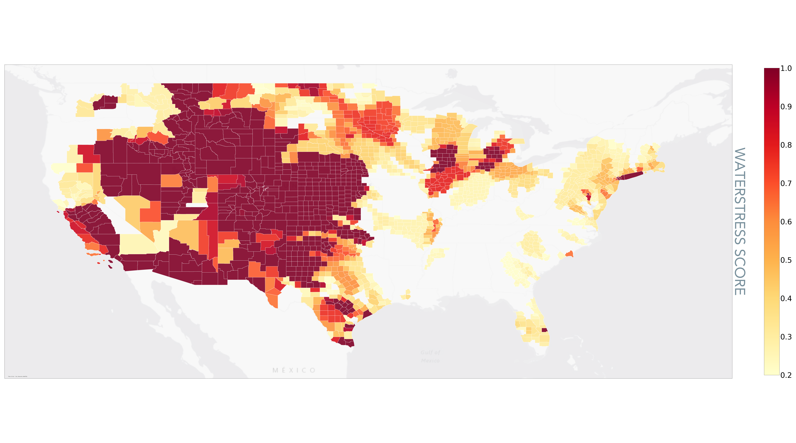

## Introduction
This Quickstart Data Guide will provide you with an introduction to Sust Global’s data capabilities. We will provide an overview of climate scenarios and our data specification and capabilities. We will introduce you to climate analytics on each of the hazards and show how they can be used to generate business intelligence insights, and also list some measures you can take to adapt and mitigate climate risk.

## Climate Scenarios
Sust Global covers climate scenario analysis following climate scenario definitions set forth from the Intergovernmental Panel for Climate Change - Coupled Model Intercomparison Project-Phase 6 [IPCC CMIP6](https://www.carbonbrief.org/explainer-how-shared-socioeconomic-pathways-explore-future-climate-change/). The IPCC AR6/CMIP6 combines frontier climate science from world leading scientific institutions with realistic climate scenario modeling. The IPCC has finalized the third part of the Sixth Assessment Report, Climate Change 2022: Mitigation of Climate Change on 4 April 2022. Climate scenarios can be thought of as a bundling of working hypotheses on the evolution of human development over the coming years. 

This guide covers the exposure of climate related hazards relating to three distinct climate scenarios:
1. **Strong Mitigation**: This scenario covers the optimal sustainable path, also referred to as the Green Road (SSP1-RCP2.6). It encompasses socioeconomic and representative emissions pathways consistent with a gradual and pervasive global shift towards a more sustainable future. Carbon emissions begin to decline around 2020 and global mean temperatures rise approximately 1.8°C by 2100, a key goal of the Paris Climate Agreement.
2. **Middle of the Road**: This scenario covers a middle path, with challenges to climate mitigation (SSP2-RCP4.5). In this scenario, environmental systems experience degradation, and climate change worsens through the end of the century. In this scenario, overall emissions continue to rise through mid-century before beginning to decline.This is a likely scenario if governments and policy reflect a strong sense of urgency towards climate adaptation. Global mean temperatures rise approximately 2.4°C by 2100, but greater emissions raise the risk of tipping points.
3. **High Emissions**: This scenario covers a future where the world continues on its current trajectory, also referred to as Fossil-Fueled Growth (SSP5-RCP8.5). Global markets are increasingly integrated and both total population and per-capita consumption increase. Emissions peak around 2090 and global mean temperatures rising approximately 4.3°C by 2100.
Hazards we cover

Sust Global’s data product provides asset level exposure to specific climate related hazards. In this section, we will cover descriptions of each of the hazards covered. Climate Explorer, Sust Global’s dashboard product provides asset level exposure insights to specific hazards. These insights are presented as time series, summary heatmaps across a portfolio of assets and sorting of assets based on their exposure to a specific hazard.

**Data Validation**: For every hazard, we derive asset level exposure data from forward looking indicators based on models from frontier climate science. We benchmark and validate data from these indicators on their hindcast (projections over historic time periods) against observations to quality the most performant functional models used in our model ensembles.

## Wildfire

Fig D1: United States Counties, Projected Mean Annual Wildfire Risk Exposure over 2022-2052.

| State | County Name | 
| - | - |
| Utah | Summit | 
| Washington | Whatcom | 
| Idaho | Custer | 
| Washington | Snohomish | 
| Colorado | San Juan | 
| California | Sutter | 
| California | Colusa | 

Table 1A: US Counties with top wildfire exposure

Fig D2: Indian towns, Projected Mean Annual Wildfire Risk Exposure over 2022-2052.

| District | City/Village | 
| - | - | 
| Moradabad | Thakurdwara | 
| Saharanpur | Deoband | 
| Muzaffarnagar | Jansath | 
| Saharanpur | Nakur |
| Muzaffarnagar| Budhana |
| Muzaffarnagar | Muzaffarnagar |
| Patiala |Patiala |

Table 1B: Indian towns with top wildfire exposure

### Description

Wildfire is an uncontrolled fire, caused by a combination of combustible fuels (such as dead, dry wood) and ignition sources (such as human activity or lightning).  It is strongly influenced by prevailing weather conditions, and typically occurs where human activity meets an accumulation of wild fuel.

### Indicators

We present 4 indicators for wildfire: observed wildfire, burned area fraction, wildfire susceptibility and unified wildfire exposure.
1. **Observed Wildfire**: We use satellite derived observations to provide asset level exposure to active wildfires. The observations are made using NASA MODIS satellites and processed using an active fire algorithm to produce the [MCD64A](https://lpdaac.usgs.gov/documents/115/MCD64_ATBD_V6.pdf). This covers the historical period of 2001 to present. This indicator shows the years in which a wildfire occurred within 1 kilometer of an asset.
2. **Burned Area Fraction**: We represent annual fire risk by ensembling CMIP6 model simulations of monthly wildfire burned area [% of grid cell]. [CMIP6 Wildfire models](https://lpdaac.usgs.gov/documents/115/MCD64_ATBD_V6.pdf) incorporate factors such as temperature, precipitation, land cover type, and population to simulate fire occurrence and the associated area burned. For example, wildfire occurrence includes both lightning and human-induced ignitions, and high temperatures and drought lead to drier fuels and increased likelihood of fire. We use Sust Global's proprietary methodologies for wildfire super resolution ([NeurIPS2020 technical reference](https://www.climatechange.ai/papers/neurips2020/45)) on top of the model ensemble to enable high resolution wildfire projections. These projections are further processed using the latest satellite-derived land cover maps, filtering for the urban-wildland interface to further refine the projections.
3. **Wildfire Susceptibility**: This indicator relates to wildfire weather and the probability of wildfire under various weather conditions using the [Keetch-Byram Drought Index (KBDI)](https://twc.tamu.edu/kbdi).  This approach has several advantages for modeling fire dynamics as previously demonstrated.  Weather has been [previously shown](https://iopscience.iop.org/article/10.1088/2515-7620/abd836) to be a major determinant of fire probability, and changing weather patterns are the primary reason wildfires will be a major hazard of climate change. Thus, in contrast to the Burned Area Fraction Indicator, this indicator does not use direct CMIP6 simulations of wildfire occurrence.  Instead, the Wildfire susceptibility estimates future fire risk using simulations of fire weather, combined with millions of historic observations of how weather affects fire risk. 
4. **Unified wildfire exposure**: This indicator combines the projections from the burned area fraction and the susceptibility score, benchmarked against the observed wildfire indicator to create a unified measure of wildfire probability at a specific location.  It can be interpreted as the probability of wildfire occurring within one kilometer of an asset location within a given year. The unified wildfire indicator when aggregated over a period of time (10 yrs) provides for a measure of probability of wildfire occurrence within 1 kilometer of the asset over the next 10 years. 

Each of the indicators: observed active fires, burned area fraction and the wildfire susceptibility provide a unique view into wildfire exposure. The observed fires demonstrate historic exposure of the asset to past occurrences of wildfire. Burned area fraction provides an indication of potential area around the asset exposure to wildfire and wildfire susceptibility provides an indicator of wildfire probability based on environmental and weather conditions. The unified wildfire exposure indicator brings these indicators together towards a single annualized wildfire probability score.

The wildfire projections from Sust Global draw on the latest, cutting edge simulations from the climate community of both fire occurrence and fire weather.  We then perform several value-adding steps, including using neural networks for super-resolving our estimates, as well as calibrating our models using millions of observations of historic fire.  We use native-resolution satellite imagery to fit and validate our models, and our unified indicator provides a more accurate multi-model ensemble view of fire risk.  Finally, our models are designed to be accurate globally, as opposed to many products that are restricted to only specific regions.

### Data Usage

The burned area fraction is most suitable for area based projections. These are often used in forest regeneration and sustainable land use assessments. Wildfire susceptibility is suitable for environmental risk assessment. The unified indicator is more suited for comprehensive environmental assessments that account for area based and time based projections.

We have benchmarked wildfire exposure in the Pacific Northwest of the United States to characterize areas of high wildfire risk potential and used the extent of exposure in these wildfire prone land parcels in this region as a reference to benchmark other regions when characterizing them as LOW/MEDIUM/HIGH.

Climate Explorer, Sust Global’s dashboard product provides asset level exposure insights to specific hazards. These insights are presented as time series, summary heatmaps across a portfolio of assets and sorting of assets based on their exposure to a specific hazard.

### Adaptation and Mitigation Measures

There are several measures you can take to protect your assets from wildfire risk. The first are simple measures:
- Add metal vents to the property. This is because unscreened vents can allow entry of airborne embers into the home, so this will prevent embers getting in.
- Replace any combustible fences (i.e. those made of wood) with metal and do not attach any combustible fences to the property.
- Install dual-pane or tempered glass windows, as these are less likely to break & allow fire to enter.
Use Class A fire-proof roofing. This is a roofing material capable of withstanding a severe fire exposure. [More on this approach here](https://www.fema.gov/pdf/hazard/wildfire/wdfrdam.pdf).
- Clean any gutters and drains of debris which can ignite. This may include leaf litter or any dry combustible materials.
- Fuel reduction: This is more of an advanced measure. It is a way to remove the vegetation around a property to reduce the risk of them catching fire. This can be achieved through manual treatment, mechanized treatments, prescribed burning, chemical treatment & grazing treatment. See pg. 223 of this [Texas government information](https://www.austintexas.gov/sites/default/files/files/hsem/Section_5_-_Mitigation_Strategies.pdf) pack for more information.
- Use [newer tools for utility repair](https://assets.new.siemens.com/siemens/assets/api/uuid:7bd3bdd9-bdb3-4263-93a4-1b0f48b01625/FINAL-SiemensEGuide-wildfire-mitigation.pdf). This will allow repairmen to remotely open and close live circuits, removing the need of a hookstick which reduces the risk of human error causing a fire.
- Monitor the status of utilities and field equipment before human inspection in order to reduce risk of fire over-pressurized oil or gas buildup.
- Use REFCL (Rapid Earth Fault Current Limiter) devices which can reduce the risk of electrical fires in a more cost-effective manner than replacing all wires with covered conductors.

## Inland Flood

Fig D3: United States Counties, Projected Mean Annual Flood Risk Exposure over 2022-2052.

| State | County Name | 
| - | - | 
| Virginia | Chesapeake | 
| Illinios | Clay |
| Mississippi | Sunflower | 
| Wisconsin | Outagamie |
| Missouri | Franklin |
| Tennessee | Obion | 
| Arkansas | Cross |

Table 2A: US Counties with top flood exposure

Fig D4: Indian towns, Projected Mean Annual Flood Risk Exposure over 2022-2052.

| District | City/Village | 
| - | - | - |
| Azamgarh | Azamgarh | 
| Murshidabad | Jangipur |
| Krishna | Avanigadda |
| Murshidabad | Baharampur |
| Darbhanga | Benipur|
| Muzaffarpur |Muzaffarpur |
| Murshidabad | Murshidabad |

Table 2B: Indian Villages with top flood exposure

### Description

Inland flooding captures the likelihood of the asset being exposed to flooding from inland storms.

### Indicators

We present two indicators: observed flooding and flood potential
1. **Observed floods**: Indicates whether anomalous standing water (i.e., a flood) was observed in a given year by satellites at the location of an asset. It is derived from NASA MODIS data, for the period 2012 to present.  
2. **Flood potential**: Indicates the potential of the asset to get exposed to flooding over the coming years expressed as a probability. A value of 0.1 indicates that we could expect a flooding event in one of the next 10 years at this asset location.

The output metric we use for inland flooding exposure ranges from 0 (low risk) to 1 (high risk). We derive this index from the collection of many simulations of flood inundated areas. We take into account multiple meteorological variables like precipitation, land surface pressure, humidity and elevation.

We only cover SSP5-RCP8.5 at the moment in the flood potential indicator

### Data Usage

We count the number of years where floods exceed a probability threshold (5% in this case) over the forward looking window (5 yr/15 yr/30 yr) and use that count to categorize the asset to LOW/MED/HIGH. LOW would be values between 0 and 1, MED would be values 2 and 3 and for assets with >3 years of flooding potential exceeding 5% probability, we would set to HIGH.

On Climate Explorer, we count the number of years where floods exceed a probability threshold (5% in this case) over a decade to create a count across each decade for the forward looking time series

The flood projections are hindcast over the range of 1980-2020 and benchmarked against observations of flooding at a global scale to validate and filter the climate models used in the inland flood projections

### Adaptation and Mitigation Measures

There are several measures you can take to protect your assets from flood risk. The first are structural measures, which are physical structures that reduce the probability of flooding:
- Levees 
- Floodwalls
- Green technologies: green roofs, rain gardens, permeable paving. 

More info is available in [this guide](https://www.floodtoolkit.com/wp-content/uploads/2015/01/Flood-Mitigation-Measures.pdf) by the UK Northamptonshire County Council for more information.

Then there are are nonstructural measures, which alter the impact of flooding, with little to no consequence on the characteristics of the flood itself:
- Structure elevation
- Dry floodproofing: This approach seals structures to prevent floodwaters from entering. This can be achieved by: applying a waterproof coating or membrane to the exterior walls of the building; installing watertight shields over doors, windows and other openings; or raising utility system components, machinery and other pieces of equipment above the flood level.
- Wet floodproofing: This approach which makes empty portions of a property resistant to floods, as it allows water to enter and flow through the property during a flood. This can be achieved  by: constructing veneers to seal potential water entry; or installing vents to allow water to move through crawl spaces under home.

## Tropical Cyclone

Fig D5: United States Counties, Projected Mean Annual Cyclone Risk Exposure over 2022-2052.

| State | County Name | 
| - | - | 
| North Carolina | Dare | 
| North Carolina | Hyde |
| North Carolina | Carteret | 
| North Carolina | Tyrrell |
| North Carolina | Pamlico |
| North Carolina | Craven | 
| North Carolina | Craven |

Table 3A: US Counties with top cyclone exposure

Fig D6: South East Asia Towns, Projected Mean Annual Cyclone Risk Exposure over 2022-2052.

| Township | Locale | 
| - | - | 
| Núi Thành | Tam Anh Bắc | 
| Phú Ninh | Tam Đại |
| Núi Thành | Tam Anh Nam | 
| Núi Thành | Tam Hải |
| Núi Thành | Tam Hòa |
| Núi Thành | Tam Xuân II | 
| Lý Sơn | An Hả |

Table 3B: South East Asian Townships with top cyclone exposure

### Description

Tropical cyclones, also referred to as hurricanes and typhoons, are one of the costliest natural disasters fueled by climate change. Since 1980, tropical cyclones in the U.S. have caused $997 billion in damages (NOAA), exceeding damages from all other weather disasters. Cyclone impacts can be widespread, including coastal and inland flooding and wind damage. These damages can directly affect assets as well as critical local infrastructure.

### Indicators

We provide two indicators, one for observed cyclone exposure and another for projected cyclone frequency. 
1. **Observed tropical cyclones**: we use cyclone tracks from the International Best Track Archive for Climate Stewardship (IBTrACS). The IBTrACS archive combines tropical cyclone datasets from global agencies and harmonizes them into a single dataset. It is endorsed by the World Meteorological Organization as the official data source for cyclone track data. For observed tropical cyclones, we filter points to only include Category 3, 4, and 5 storm points. We then assume a constant ‘impact radius’ of 150 miles/ 241km.
2. **Forward looking Cyclone Pojections**: We quantify current and forward-looking cyclone exposure by focusing on the frequency of extreme tropical cyclones. Extreme tropical cyclones, referred to as Category 3, 4, and 5 storms on the Saffir-Simpson hurricane scale, are defined as having maximum sustained winds above 110mph/178km/h. We focus on these extreme storms because of their heightened destructive potential relative to weaker storms. Since the number represents a frequency, it indicates the expected number of CAT3/4/5 cyclones over a year. By aggregating the values over a time range of 15 years, the user can arrive at a projected number of cyclones exposed to the asset over the 15 year window.  

For forward-looking cyclone exposure, Sust Global combines the latest CMIP6-based cyclone track simulations with our proprietary bias-correction methodology to enable more accurate assessment of local exposure. The CMIP6 cyclone tracks are unique because they are based on high-resolution simulations specifically designed to enable more reliable assessment of climate risk from weather phenomena like tropical cyclones. These simulations are only achievable due to recent advancements in supercomputing power.  

The CMIP6-based cyclone track simulations are drawn from research led by Dr. Malcolm Roberts of the UK Met Office ([technical reference](https://agupubs.onlinelibrary.wiley.com/doi/full/10.1029/2020GL088662)). The simulations are based on CMIP6 HighResMIP simulations with resolutions as high as 25km. The CMIP6 HighResMIP project is co-chaired by Roberts. The authors applied two different cyclone track algorithms to determine when an input set of CMIP6 oceanic and atmospheric conditions over time and space constitutes a high likelihood of a tropical cyclone track.

### Limitations

- For forward looking cyclone exposure, our data is point based. Our methodology translates these storm track points into geospatial polygons indicative of cyclone exposure. When determining asset exposure, we assume an ‘impact radius’ of 150 miles (241km) from the cyclone center to better capture coastal and inland flooding exposure.
- The simulations are only available for SSP5-8.5 to 2050. 
- The raw wind speed estimates are biased, so we cannot reliably filter for specific category storms with the raw wind values provided. This bias in wind speed is in part due to physical constraints of the CMIP6 models. Prior research has shown that they are mathematically incapable of producing wind speeds seen in extreme cyclones.

### Data Usage

We have identified three regions for model evaluation known to have high historical exposure to extreme cyclones: the Gulf of Mexico, South Asia, and China. We have used these regions to benchmark and calibrate risk exposure to the different categories of HIGH, MEDIUM and LOW

To benchmark model performance and enable bias-correction, we leveraged a global cyclone tracks database endorsed by the World Meteorological Organization as the best resource for historical cyclone tracks (the same database used for observed tracks). We choose the years 1979-2020 to develop and evaluate the bias-correction procedure. 
1. First, we identified three regions for model evaluation known to have high historical exposure to extreme cyclones: the Gulf of Mexico, South Asia, and China. Since 1979 these regions have experienced between 23, 16, and 26 Category 3 and above land-falling cyclones, respectively. The raw ensemble of climate models’ root mean squared error is a whopping 121 cyclones during the historical period.  
2. Next, we identified wind speed thresholds to bias-correct the simulations, filtering the tracks by wind speed. Rather than a raw speed value, we instead remove track points that fall below the 90th percentile wind speed for that model, effectively subsetting for the top 10% track points in each model. I also experimented with a threshold of 60th percentile, and with a thresholding approach based on modeled sea-level pressure instead of modeled wind speed. Future iterations could estimate an optimal threshold individually for each model. 4 model runs were also removed based on quantitative and visual inspection.
3. Overall, we see that while some of the models still overestimate or underestimate the number of land-falling storms, the ensemble mean reasonably simulates the correct number of storms in each region. Sust’s bias-corrected ensemble of models have a root mean squared error of 9 cyclones, a 92% reduction in error relative to the raw simulations. 

### Adaptation and Mitigation Measures

There are several measures you can take to protect your assets from cyclone risk.

Please note that the major impacts of cyclones are storm surges, strong wind and flood. Therefore, mitigation measures will also include those in the relevant corresponding hazard sections.

Here are some preventative measures against cyclones:
- Living shorelines: Salt marshes and mangroves act as natural barriers which trap sediment and organic matter, so they grow in elevation which protects against rising sea levels and therefore storm surges.
- Green technologies: green roofs, rain gardens, permeable paving - read [this guide](https://www.floodtoolkit.com/wp-content/uploads/2015/01/Flood-Mitigation-Measures.pdf) by the UK Northamptonshire County Council for more information.
- Vegetation cover improvement. This improves water infiltration capacity of land.
- Flood management (as seen in the Inland Flooding section)

Here are measures that reduce damage once a cyclone hits:
- Raised embankments or levees can protect against a flood or storm surge.
- Retrofitting non-engineered structures, which is particularly relevant in areas such as India which are prone to cyclones but residents tend to design their own non-engineered homes.
-The roof can be retrofitted to be more resilient to cyclones by: using reinforcing gabled roofs; applying adhesive to roof shingles; and hurricane straps and clips to keep the roof in place.
- Openings can be retrofitted to be more resilient to cyclones by: reinforcing entry doors and protecting them with fabric screens.
- Cyclone shelters can protect people, particularly if it is close to a property.
- Artificial hills for people to stand on during a cyclone.

## Sea Level Rise

Fig D7: United States Counties, Projected Mean Annual Sea Level Rise Risk Exposure over 2022-2052.

| State | County Name | 
| - | - | 
| New Jersey | Ocean | 
| New Jersey | Cumberland |
| New Jersey | Burlington | 
| New Jersey | Atlantic |
| Maryland | Wicomico |
| Virginia | Northampton | 
| Maryland | Caroline |

Table 4A: US Counties with top sea level rise exposure

Fig D8: Indian towns, Projected Mean Annual Sea Level Rise Risk Exposure over 2022-2052.

| District | City | 
| - | - | 
| 24 Parganas | North 24 Parganas| 
| 24 Parganas | South 24 Parganas |
| Purba Medinipur | Tamluk | 
| Bhadrak | Bhadrak |
| Baleshwar | Baleshwar |
| Kendrapara | Kendrapara | 
| Puri | Puri |

Table 4B: Indian towns with top sea level rise exposure

### Description

This hazard refers to rising sea levels. The major physical impacts of a rise in sea level include erosion of beaches, inundation of deltas as well as flooding and loss of many marshes and wetlands.

### Indicator

The sea level rise indicator refers to the change in sea level from the changing climate across different climate scenarios. We base our modeling of projected sea level rise on both climate model simulations and an asset’s distance to the coast. Projected sea level rise from CMIP6 climate models incorporates the effects of thermal expansion from warming of the ocean, since water expands as it warms, which is expected to be the primary component of future sea level rise. The models do not incorporate the secondary contributions of melting glaciers and ice caps since they cannot reliably simulate them, so the sea level simulations are conservative estimates of total sea level rise. The sea level rise is calculated by combining the monthly CMIP6 local sea level fluctuations due to ocean dynamics and global sea level rise from thermal expansion. We center the sea level rise over the baseline period 1980-2010. 

We enable asset level assessments of exposure to physical hazard from sea level rise. We express sea level rise relative to a 1980-2010 baseline period for assets within 5km from the coast. An asset’s distance to the nearest coastline is derived using 0.01 degree resolution, satellite-derived estimates of coastline locations from NASA’s Ocean Color Group. Assets beyond 5km from the nearest coastline are assumed to have no sea level risk in our assessments, though we can change this 5km threshold if needed. Technically the coastline product is at 0.04 degree resolution, but the providers converted it to 0.01 degree using bilinear interpolation and say the uncertainty is up to 1km

The models do not incorporate the secondary contributions of melting glaciers and ice caps since they cannot reliably simulate them, so the sea level simulations are conservative estimates of total sea level rise.

### Adaptation and Mitigation Measures

There are several measures you can take to protect your assets from sea level rise risk.

The first are hard defenses:
- Coastal armouring. This includes sea walls or levees.
- Bulkheads are vertical walls that retain soil but provide little protection from waves/
- Revetments are sloping structures on banks and cliffs.

There are also soft defenses:
- Living shorelines: Salt marshes and mangroves act as natural barriers which trap sediment and organic matter, so they grow in elevation which protects against rising sea levels. They also absorb incoming wave energy and are more effective than bulkheads (read this article for more information).
- Green technologies: green roofs, rain gardens, permeable paving - read [this guide](https://www.floodtoolkit.com/wp-content/uploads/2015/01/Flood-Mitigation-Measures.pdf) by the UK Northamptonshire County Council for more information.

## Water Stress

Fig D9: United States Counties, Projected Mean Annual Water Stress Risk Exposure over 2022-2052.

| State | County Name | 
| - | - | 
| Nebraska | Holt | 
| Nebraska | Cherry |
| Montana | Park | 
| Montana | Pondera |
| Montana | Powder River |
| Montana | Rosebud| 
| Montana | Silver Bow |

Table 5A: US Counties with top water stress exposure

Fig D10: Australian towns, Projected Mean Annual Water Stress Risk Exposure over 2022-2052.

| Township | Locale | 
| - | - | 
| South Australia | Playford| 
| South Australia | Prospect |
| Victoria | Gannawarra | 
| New South Wales | Jerilderie |
| South Australia | Marion |
| South Australia | Mitcham | 
| South Australia | Onkaparinga |

Table 5B: Australian cities with top water stress exposure

### Description

Water is a requirement for societal development and progress. Water availability, or in its absence water scarcity, plays a critical role across sectors, including manufacturing, mining, agriculture, and electricity generation. Climate change coupled with increasing demand will have substantial impacts on water availability across the globe. Rigorous, high resolution water supply and demand data is therefore needed to enable reliable assessment of companies’ water scarcity exposure directly and throughout their supply chains. Projections of future water availability can help companies and investors prepare for the complex economic and social challenges related to water stress.

### Indicator

We provide 4 indicators: historic water stress, projected droughts, projected water stress score, projected unified water stress.

1. **Water stress score indicator**: We model current and forward-looking water stress scores using the World Resource Institute’s Aqueduct model. The state-of-the-art Aqueduct model has been extensively used by researchers in academia and industry to assess portfolio water risk. The water stress score is indicative of competition for local water resources. It is calculated as the ratio of water withdrawal to renewable water availability.
2. **Drought indicator**: This indicator is based on a drought index derived from CMIP6 monthly simulations of precipitation and temperature. The drought index, also referred to as the standardized precipitation evapotranspiration index, represents the magnitude of precipitation deficits (negative magnitude) or surplus (positive magnitude) over the preceding 12-month period, after accounting for temperature-driven effects on evapotranspiration. Our selection of a 12-month period reflects long-term precipitation patterns and better relates to reservoirs, groundwater, and streamflow.  
3. **Unified water stress indicator**: combines the water stress score and the drought indicator to one single indicator for water stress, using a weighting methodology designed by the World Resources Institute.  This provides a comparable 0-1 indicator of water stress risk.
4. **Historic water stress indicator**: We use the same methodology as the unified water stress indicator, except with observed rather than modeled datasets of water stress and drought.

Water stress scores account for the availability and consumption of water at the specific location. The drought indicator accounts for environmental variables that create acute water shortage over a period of time. Both are chronic physical climate hazard indicators.

Our water stress indicator is based on the world leading WRI water stress methodology ([link](https://www.wri.org/data/aqueduct-global-maps-30-data)) and our drought indicator is based on the latest frontier climate research from the CMIP6([link](https://link.springer.com/article/10.1007/s00382-017-3740-8)). 

### Data Usage

A key avenue for mitigating water stress not considered in the modeling framework is the transport of water between watersheds. Such transport can help meet water demand, but it comes at a cost. Transporting water requires large amounts of energy, increasing greenhouse gas emissions, along with the development of transportation infrastructure. Water transport also carries with it a host of geopolitical and equity considerations. 

- Water stress scores are more suitable for use for assessments of impact from the changing climate to human water needs
- Drought indicator is most useful for water stress impacts to agriculture and commodities 
- The unified water stress indicator is most useful across generic use cases

### Adaptation and Mitigation Measures

- Water harvesting. This involves water treatment and reuse of wastewater, or recycling water.
- Enhance the supply of water. This may involve: developing new water sources such as micro dams, ponds and wells; locating new potential resources; or artificial precipitation.
- Improve demand management by reducing use & loss of water, or reviewing water allocation, particularly to water intensive processes such as certain manufacturing methods.

## Heatwave

Fig D11: United States Counties, Projected Mean Annual Heatwave Risk Exposure over 2022-2052.

| State | County Name | 
| - | - | 
| Florida | Monroe | 
| Florida | Miami-Dade |
| Florida | Collier | 
| Florida | Palm Beach |
| Texas | Nueces |
| Texas | Brazoria| 
| Louisiana | Terrebonne |

Table 6A: US Counties with top water stress exposure

Fig D12: Indian towns, Projected Mean Annual Heatwave Risk Exposure over 2022-2052.

| Township | Locale | 
| - | - | 
| Lakshadweep | Kavaratti| 
| Lakshadweep | Amini Island |
| Lakshadweep | Lakshadweep | 
| Nicobar Island | Nicobar Island |
| South Andaman | South Andaman |
| Thiruvananthapuram | Chirayinkil | 
| Thiruvananthapuram | Nedumangad |

Table 6B: Indian cities/towns with top water stress exposure

### Description

Heatwaves represent an extended period of perilously warm weather at a specific location or region.

### Indicator

We calculate the number of days per year exceeding a temperature threshold. The temperature threshold at a given location is based on the 98th percentile of daily conditions during a baseline period between 1980 and 2100. Because this temperature threshold varies spatially, the heatwave metric indicates anomalously high temperatures relative to what is typical at the local level. 

### Data Usage

The heatwave indicator is derived from the world’s frontier climate research as part of the CMIP6. The user can interpret this metric at a specific asset location or region as the number of days in a calendar year of unusually warm weather 

### Adaptation and Mitigation Measures

You can take some cooling measures which reduce electricity demand, in part by using cooling measures which improves the reliability of electricity.
- Install cool or green roofs, which may involve switching from dark to light roofs.
- Plant trees and vegetation near buildings, as these can provide shade.
- Set up cool routes (shaded walkways) and emergency cooling centers for people during a heatwave.

## Summarization Labeling

| Hazard | Unit | LOW Range (low) | LOW Range (high) | MEDIUM Range (low) | MEDIM Range (high) | HIGH Range (low) | HIGH Range (high) |  
| - | - | - | - | - | - |  - | - | 
| Wildfire | probability | 0.0 | 0.01 | 0.01 | 0.05 | 0.05 | 1.0 |
| Inland Flood | Number of years with probability exceeding threshold @ | 0 | 0 | 1 | 3 | 3 | 30 |
| Cyclone | probability | 0.0 | 0.1 | 0.1 | 0.2 | 0.2 | 1.0 |
| Water Stress | probability | 0.0 | 0.3 | 0.3 | 0.6 | 0.6 | 1.0 |
| Heatwave | Number of days in year | 0 | 30 | 30 | 50 | 50 | 366 |
| Sea Level Rise | Relative change in meters | 0.0 | 0.1 | 0.1 | 0.3 | 0.3 | 3.0 |

Table 7: Hazard summarization labeling ranges 

@ For floods, we count the number of years where floods exceed a probability threshold (5% in this case) over the forward looking window (5 yr/15 yr/30 yr) and use that count to categorize the asset to LOW/MED/HIGH. LOW would be values between 0 and 1, MED would be values 2 and 3 and for assets with >3 years of flooding potential exceeding 5% probability, we would set to HIGH

## Indicator Metadata

| hazard    |  indicator    |  unit   |   value_min  |  value_max  |  value_norm  |  spatial_resolution (in meters) |
| - | - | - | - | - |- |- |
| wildfire | obs_score | score | 0.0 | 1.0 | 1.0 | 300.0 |
| wildfire | burned_area_norm   | score | 0.0 | 1.0 | 0.1 | 300.0 |
| wildfire | fire_kbdi_susceptability | score | 0.0 | 1.0 | 0.1 | 300.0 |
| wildfire | unified_prob | score | 0.0 | 1.0 | 0.1 | 300.0 |
| flood_potential | obs_score | score | 0.0 | 1.0 | 1.0 | 1000.0 |
| flood_potential | inland_flood_prob | score | 0.0 | 1.0 |  1.0 | 4000.0 |
| cyclone | obs_freq | frequency | 0.0 | 7.0 | 2.0 | 1000.0 |
| cyclone | prob  | score | 0.0 | 1.0 | 0.5 | 50000.0 |
| heatwave | freq | day | 0.0 | 366.0 | 200.0 | 25000.0 |
| sea_level_rise | change | meter | 0.0 | 100.0 | 0.75 | 100000.0 |
| water_stress | spei_norm | score |  0.0 |  1.0 |  1.0 |  25000.0 |
| water_stress | score | score | 0.0 | 1.0 | 1.0 | 500.0 |
| water_stress | obs_score | score | 0.0 | 1.0 | 1.0 | 500.0 |
| water_stress | unified_score | score | 0.0 | 1.0 | 1.0 | 500.0 |
| fundamental | temp | degree_celsius | -60.0 | 50.0 | 50.0 | 100000.0 |
| fundamental | precip | millimeter | 0.0 | 10000.0 | 5000.0 | 100000.0 |
| fundamental | extreme_precip | day | 0.0 | 366.0 | 366.0 | 100000.0 |

Table 8: Hazard and indicator metadata 

