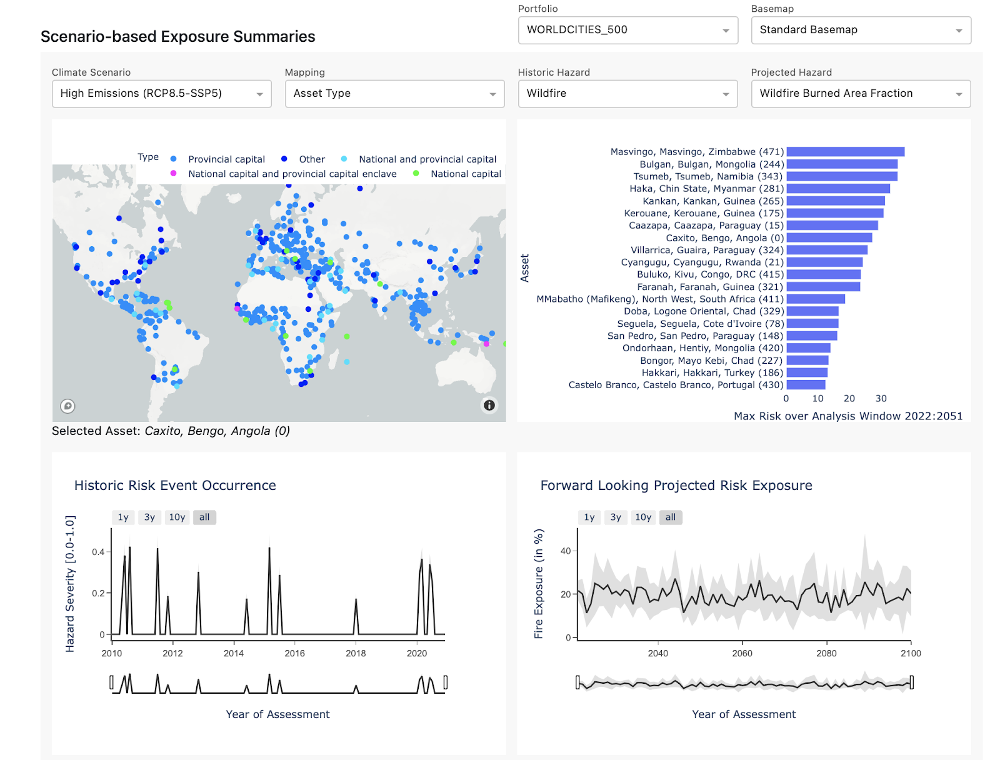

The following is a list of running product updates to the Climate Explorer ecosystem.

## <ins>5/2/22: Customer Update: Data Change to Error Bar Calculations</ins>

As of May 1, 2022, we have made an update to how we estimate risk in order to more accurately represent uncertainty and the spread of modeled outcomes. Our error bars will now show the 16th and 84th percentile of represented models, rather than +/- one standard deviation.  Additionally, projections will show median instead of mean values, reducing the influence of outlier projections from our models.  Correspondingly, our Low/Medium/High calculations are now based on median values instead of mean values. *This feature has not yet been rolled out for cyclones.*

## <ins>5/2/22: Customer Update: Drought Indicator Data Rescale</ins>

Beginning May 1, 2022, we have released updated Drought indicator data (API indicator named spei_norm under hazard: water_stress), rescaling values to a more intuitive range and increasing the number of source models used to construct the metric from 5 CMIP6 models to 21 CMIP6 models. With the new Drought rescaling, drought index (SPEI) values fall between an easy to interpret 0 to 1 range, reaching index values of 1.0 if the drought exposure are at unprecedented levels relative to the 1950 to 2014 historical period and value of 0.0 indicating no drought exposure. The increase in contributing CMIP6 models to our product will provide better model ensembles with more representative confidence intervals in the forward-looking drought projections.


## <ins>5/2/22: Customer Update: Wildfire Forward Looking Projection Data</ins>

As of April, 2022, the Climate Explorer backend data source for Wildfire Burned Area Fraction and Historic Fire has been updated to include a high spatial resolution mask of  non-burnable areas. The dataset now includes  higher resolution land cover masks to determine if an area is at risk of fire or has seen historic fires. For existing customers, there may be underlying data changes in those assets*, especially those* bordering urban/rural boundaries.

## <ins>5/2/22: Customer Update: Automated Historic Fire Data</ins>

As of April, 2022, Sust Global now has an automated historic fire data ingestion process.  Historic fire data in Climate Explorer is now derived from a satellite feed, and continuously displays the latest data as soon as it is released.

## <ins>4/15/22: UI Change – Project Switch Feature</ins>

As of April, 2022, our UI has changed to include a simpler way to switch between projects in the top right bar of Climate Explorer.

## <ins>4/15/22: Drought Indicator Data Rescale</ins>

*Please note the upcoming change to the Drought (SPEI) Indicator.*

Beginning May 2, 2022, we will release updated Drought indicator data, rescaling values to a more intuitive range and increasing the number of models used to construct the metric from 5 CMIP6 models to 21 CMIP6 models.

With the new Drought rescaling, drought index (SPEI) values fall between an easy to interpret 0 to 1 range, reaching index values of 1.0 if the droughts are unprecedented relative to the 1950 to 2014 historical period. With the substantial increase in contributing CMIP6 models, we have greater confidence in the forward-looking drought projections and estimates of uncertainty.

## <ins>4/15/22: API Indicator Metadata Change</ins>

As of April, 2022, Sust Global’s Indicator level metadata has changed. Below is an example of how to secure indicator level metadata from our API:

GET [https://explorer.sustglobal-staging.io/api/portfolios/[YOUR_PORTFOLIO_NAME]/datasets/physical?project=[YOUR_PROJECT_NAME]](https://explorer.sustglobal-staging.io/api/portfolios/:portfolio_name/datasets/physical?project=bw-004)

Giving you a representative response as follows:

```
{

"portfolio_name": "DEMO",

"created_at": "2022-04-12T23:34:59Z",

"updated_at": "2022-04-12T23:34:59Z",

"sha256_digest": "c497595ec7e16b1e36c37baa4bed6abef2ab4f3749495d97de7ef9cb3370758a",

"indicators": [

{

"hazard": "wildfire",

"indicator": "obs_score",

"unit": "score",

"value_min": 0.0,

"value_max": 1.0,

"value_norm": 1.0,

"spatial_resolution": 300.0

},

{

"hazard": "flood_potential",

"indicator": "obs_score",

"unit": "score",

"value_min": 0.0,

"value_max": 1.0,

"value_norm": 1.0,

"spatial_resolution": 1000.0

},

{

"hazard": "cyclone",

"indicator": "obs_freq",

"unit": "frequency",

"value_min": 0.0,

"value_max": 2.0,

"value_norm": 2.0,

"spatial_resolution": 1000.0

},

{

"hazard": "wildfire",

"indicator": "burned_area_norm",

"unit": "score",

"value_min": 0.0,

"value_max": 1.0,

"value_norm": 1.0,

"spatial_resolution": 6900.0

},

{

"hazard": "wildfire",

"indicator": "fire_kbdi_susceptibility",

"unit": "score",

"value_min": 0.0,

"value_max": 1.0,

"value_norm": 1.0,

"spatial_resolution": 300.0

},

{

"hazard": "flood_potential",

"indicator": "inland_flood_prob",

"unit": "probability",

"value_min": 0.0,

"value_max": 1.0,

"value_norm": 1.0,

"spatial_resolution": 4000.0

},

{

"hazard": "water_stress",

"indicator": "spei_norm",

"unit": "score",

"value_min": -3.0,

"value_max": 3.0,

"value_norm": 3.0,

"spatial_resolution": 100000.0

},

{

"hazard": "water_stress",

"indicator": "score",

"unit": "score",

"value_min": 0.0,

"value_max": 4.0,

"value_norm": 4.0,

"spatial_resolution": 500.0

},

{

"hazard": "sea_level_rise",

"indicator": "change",

"unit": "meter",

"value_min": -0.2,

"value_max": 2.0,

"value_norm": 0.75,

"spatial_resolution": 100000.0

},

{

"hazard": "cyclone",

"indicator": "prob",

"unit": "probability",

"value_min": 0.0,

"value_max": 1.0,

"value_norm": 0.5,

"spatial_resolution": 50000.0

},

{

"hazard": "heatwave",

"indicator": "freq",

"unit": "day",

"value_min": 0.0,

"value_max": 365.0,

"value_norm": 200.0,

"spatial_resolution": 100000.0

},

{

"hazard": "fundamental",

"indicator": "temp",

"unit": "degree_celsius",

"value_min": -5.0,

"value_max": 45.0,

"value_norm": 45.0,

"spatial_resolution": 100000.0

},

{

"hazard": "fundamental",

"indicator": "precip",

"unit": "millimeter",

"value_min": 0.0,

"value_max": 5000.0,

"value_norm": 5000.0,

"spatial_resolution": 100000.0

},

{

"hazard": "fundamental",

"indicator": "extreme_precip",

"unit": "day",

"value_min": 0.0,

"value_max": 365.0,

"value_norm": 365.0,

"spatial_resolution": 100000.0

}

]

}
```

## <ins>4/15/22: Entity_ID-based filtering added to API</ins>

As of April, 2022, we have added Entity ID as a request parameter in our API. This update was made to three different endpoints: assets, physical risk summary and physical risk time series.

With entity ID filtering, customers can now filter API responses to get resulting asset metadata, risk exposure data and risk exposure summaries for a specific asset in the portfolio.

Below is an example of how to filter summary end point results based on a specific entity_id [ENTITY_ID] using this new feature:

GET [https://explorer.sustglobal-staging.io/api/portfolios/[YOUR_PORTFOLIO_NAME]/datasets/physical/summary?project=[YOUR_PROJECT_NAME]](https://explorer.sustglobal-staging.io/api/portfolios/:portfolio_name/datasets/physical?project=bw-004)&hazard=[HAZARD_NAME]&indicator={INDICATOR_NAME]&entity_id=[ENTITY_ID]

Giving you a representative response as follows:

```
**{**

**"portfolio_name": "ec-DEMO",**

**"portfolio_index": 20,**

**"entity_name": "AGE",**

**"entity_id": "Logistics",**

**"risk_summaries": [**

**{**

**"window": 30,**

**"window_start_year": 2022,**

**"scenario": "ssp126",**

**"hazard": "fire",**

**"risk_label": "LOW",**

**"risk_score": 0.0648730561815109**

**},**

**{**

**"window": 30,**

**"window_start_year": 2022,**

**"scenario": "ssp245",**

**"hazard": "fire",**

**"risk_label": "LOW",**

**"risk_score": 0.060258992778519**

**},**

**{**

**"window": 30,**

**"window_start_year": 2022,**

**"scenario": "ssp585",**

**"hazard": "fire",**

**"risk_label": "LOW",**

**"risk_score": 0.0776790953102628**

**}**

**]**

**}**
```

## <ins>3/28/22: FAQ Documentation on Developer Center</ins>

As of March, 2022, the Sust Global Developer Center has been updated with a new [FAQs section](https://developers.sustglobal.com/) for Climate Explorer.

## <ins>3/28/22: Service Accounts Feature</ins>

Starting April 1, 2022, customers will have access to a Service Accounts feature under a new “Project Settings'' tab within Climate Explorer. Service accounts are non-user specific privileged accounts, and can be used by customers  executing applications and running automated services with our API. Service accounts offer a high level of security for customers accessing the Climate Explorer under a shared team login, and can easily be referenced in applications or processes.


## <ins>3/21/22: UI Changes</ins>

As of March 2022, there has been a UI update to the Climate Explorer Risk Exposure dashboard. The first four plots (the Scenario based Exposure Summaries and Historic and Projected Risk Exposure) can now all be configured via a single set of drop downs.

<p align="center">

</p>

Additionally, the drop down label for “Asset Grouping” has been renamed to “Mapping.”

The number following the asset display name is the “portfolio index” (see below example of WORLDCITIES_500) represents the row index of the asset in the originally-uploaded CSV file.


## <ins>3/11/22: New Hazard – Water Stress Score</ins>

As of Monday, March 7th, 2022, Sust Global has added a new hazard type: Water Stress. This hazard covers a water stress score and drought (normalized [SPEI](https://spei.csic.es/)) as indicators. Additionally, there are plans to roll out a historic water stress score in the near future

Water Stress is now live in Climate Explorer, and includes the following description in the [User Guide](https://developers.sustglobal.com/userguide.html):

We model current and forward-looking water stress scores using the World Resource Institute’s Aqueduct model. The state-of-the-art Aqueduct model has been extensively used by researchers in academia and industry to assess portfolio water risk.

The presented water stress score is the ratio of water withdrawal to renewable water availability. Water withdrawal incorporates a diverse set of global data sources, including: population, livestock, agriculture, irrigation, and other socioeconomic factors. They encompass domestic, industrial, irrigation, and livestock uses. Renewable water availability, which includes surface and groundwater pools, is calculated using a global hydrological model that incorporates meteorological and landscape characteristics.

In basins experiencing high water stress (>0.4), withdrawals are large relative to renewable available water, indicating greater competition for water resources. This ratio can exceed 1.0 when non-renewable water sources like aquifers are accessed, and in practice we clip any outliers exceeding 4.0. We also interpolate values in missing years.

Currently, all climate models are run under the High Emissions or Middle of the Road scenarios with CMIP5-based meteorological inputs, so the water stress score values presented for the Strong Mitigation scenario are identical to those in the Middle of the Road scenario. Simulations were also only run out to 2050, so exposure values for 2051-2100 represent the mean over the 2030-2050 period. We plan to expand our offering to include a Strong Mitigation scenario and to extend beyond 2050 in a future product update.

## <ins>3/11/22: New Hazard Views: Wildfire Susceptibility & WIldfire Burned Area Fraction</ins>

On Monday, March 7th, 2022, new hazard labels were added for wildfires in Climate Explorer: Wildfire Susceptibility & Wildfire Burned Area Fraction. In Q2 2022, we will have additional updates to historic data.

Thresholds for this hazard have been updated within the [Quickstart Guide](https://developers.sustglobal.com/explorer.html), & the [User Guide](https://developers.sustglobal.com/userguide.html) has been updated with the following information:

**<ins>Wildfire: Burned Area Fraction</ins>**

We represent annual fire risk by aggregating CMIP6 model simulations of monthly wildfire burned area [% of grid cell]. Wildfire [models](https://www.sciencedirect.com/science/article/abs/pii/S0921818116303770?via%3Dihub) incorporate factors such as temperature, precipitation, land cover type, and population to simulate fire occurrence and the associated area burned. We use our proprietary methodologies for wildfire super resolution [NeurIPS2020 technical reference on](https://www.climatechange.ai/papers/neurips2020/45) top of the model ensemble to enable high resolution wildfire projections. These projections are further processed using the latest satellite derived land cover maps, filtering for the urban-wildland interface to further refine the projections.

For example: fire occurrence includes both lightning and human-induced ignitions, and high temperatures and drought lead to drier fuels and increased likelihood of fire.

**<ins>Wildfire Susceptibility</ins>**

We also use fire weather as an indicator of fire risk. This indicator shows the average annual probability of a fire occurring within a kilometer of the asset location. We derive this indicator based on the historic functional relationship between fire weather and the daily probability of fire, taking into account on-the-ground characteristics like land cover types and climate zones that constrain vegetation types and structure. We then apply this functional relationship based on historic observations to ensembled CMIP6 predictions of future weather to estimate future fire probabilities.

When estimating fire risk for a given asset, we take the average risk over all land cover types within 1 kilometer. Thus, for an asset that has 50% urban areas and 50% forested areas within 1 kilometer, the fire probability is the mean of the fire risk for these two land cover types.
