The Climate scenario analysis platform from Sust Global allows operational risk analysts, quantitative modelers and ESG analysts to assess historic, near-term and long-term impacts of climate change. We provide historic risk exposure scores for fires, floods and cyclones over the past 11 years (Jan 2010- Dec 2020). For forward-looking projections of extreme physical climate hazards, we provide risk exposures across standardized climate scenarios.

In this User Guide, we: give an overview of the outputs from climate scenario analysis; describe the hazards that we are covering in our analysis; describe the different views available within our platform; and provide guidance on interpreting the results from our climate scenario analysis.

## Climate Scenarios

Our climate scenario analysis  follows definitions set forth from the Intergovernmental Panel for Climate Change - Coupled Model Intercomparison Project-Phase 6 [IPCC CMIP6](https://www.carbonbrief.org/explainer-how-shared-socioeconomic-pathways-explore-future-climate-change). The IPCC AR6/CMIP6 combines frontier climate science from world leading scientific institutions with realistic climate scenario modeling.

This guide covers the following three distinct climate scenarios:
1. **Strong Mitigation:** This scenario covers the optimal sustainable path, also referred to as the Green Road (SSP1-RCP2.6). It encompasses socioeconomics and representative emissions pathways for a graduate and pervasive global shift towards a more sustainable future. Carbon emissions begin to decline around 2020 and global mean temperatures rise approximately 2°C by 2100, a key goal of the Paris Climate Agreement.
2. **Middle of the Road:** This scenario covers a middle path, with challenges to climate mitigation (SSP2-RCP4.5). In this scenario, environmental systems experience degradation, and although there are some improvements. overall the intensity of resource and energy use declines. This is a likely scenario if governments and policy reflect a strong sense of urgency towards climate adaptation. This is a likely scenario if governments and policy reflect a strong sense of urgency towards climate adaptation. Global mean temperatures rise approximately 3°C by 2100.
3. **High Emissions:** This scenario covers a future where the world continues on its current trajectory (SSP5-RCP8.5). There is continued reliance on competitive markets to produce rapid technological progress. Global markets are increasingly integrated. There is a high reliance on fossil fuels, with emissions peaking around 2090 and global mean temperatures rising approximately 5°C by 2100.

## Physical Hazard Modeling
We report on 7 acute physical hazards at the asset level: wildfire, drought, heatwaves, flooding, sea level rise, tropical cyclones, and water stress. The modeled results are stored as time series for each specific asset within a portfolio of assets.

### Wildfire

#### Wildfire Burned Area Fraction
We represent annual fire risk by aggregating CMIP6 model simulations of monthly wildfire burned area [% of grid cell]. Wildfire [models](https://www.sciencedirect.com/science/article/abs/pii/S0921818116303770?via%3Dihub) incorporate factors such as temperature, precipitation, land cover type, and population to simulate fire occurrence and the associated area burned. For example, fire occurrence includes both lightning and human-induced ignitions, and high temperatures and drought lead to drier fuels and increased likelihood of fire. We use our proprietary methodologies for wildfire super resolution [NeurIPS2020 technical reference](https://www.climatechange.ai/papers/neurips2020/45) on top of the model ensemble to enable high resolution wildfire projections. These projections are further processed using the latest satellite-derived land cover maps, filtering for the urban-wildland interface to further refine the projections.


#### Wildfire Susceptibility

We also use fire weather as an indicator of fire risk.  This indicator shows the average annual probability of a fire occurring within a kilometer of the asset location.  We derive this indicator based on the historic functional relationship between fire weather and the daily probability of fire, taking into account on-the-ground characteristics like land cover types and climate zones that constrain vegetation types and structure.  We then apply this functional relationship based on historic observations to ensembled CMIP6 predictions of future weather to estimate future fire probabilities.  

When estimating fire risk for a given asset, we take the average risk over all land cover types within 1 kilometer.  Thus, for an asset that has 50% urban areas and 50% forested areas within 1 kilometer, the fire probability is the mean of the fire risk for these two land cover types.

### Drought
To estimate an asset’s exposure to drought, we utilize a drought index based on CMIP6 simulations of precipitation and temperature, from which we estimate potential evapotranspiration. This is the more suitable index for agricultural assets like farms and farm production sites. Drought scores range from 0 [low exposure] to 1 [high exposure]. Values between 0.5 and 0.67 indicate moderate dryness, while values above 0.67 indicate severe dryness. These values represent a simple rescaling of calculated SPEI values designed to be more interpretable. The rescaling sets SPEI values above 0 (wet) to 0, reverses the sign, and normalizes by 3.0. Drought index values are calculated relative to a historical 1950-2014 baseline period, and future droughts can reach index values of 1.0 if the droughts are unprecedented relative to the 1950-2014 historical period.

### Heatwaves
For heatwaves, we calculate the number of days per year exceeding a temperature threshold. The temperature threshold at a given location is based on the local, daily conditions during a baseline period between 1980 and 2010. Because this temperature threshold varies by location, the heatwave metric indicates anomalously high temperatures relative to what is typical at the local level.

### Inland Flooding
We base our modeling of inland riverine flooding exposure on [recent advances](https://www.nature.com/articles/s41558-018-0257-z?WT.feed_name=subjects_hydrology) in combining climate models, hydrological models, local flood defense data, and high-resolution elevation maps. Coastal flooding from sea level rise or storm surges are not considered in this metric. When calculating whether a flood will occur, the framework incorporates local resilience information, such as 1 in 100 year design thresholds for dams and levees, based on a [global atlas](https://www.un-spider.org/links-and-resources/data-sources/flopros-evolving-global-database-flood-protection-standards-vrije) of flood defenses.

The output metric we derive for inland flooding exposure ranges from 0 (low risk) to 1 (high risk) based on a collection of 50 simulations of inundated areas. The 50 simulations are derived from combining projections of variables like precipitation and humidity from 5 climate models with 10 hydrological models that simulate daily runoff levels. Then, high-resolution inundation modeling is performed using satellite-derived elevation maps that provide detailed views of local river networks. A value of 0 ( the most common since inland floods are inherently rare) indicates none of the simulations predicted a flood.

Currently, all climate models are run under the High Emissions scenario, so the flood exposure values presented for the Strong Mitigation and Middle of the Road scenarios are identical to those in the High Emissions scenario. We plan to expand our offering to all three scenarios in a future product update. When representing the heatmap, we look at the number of years over which 5% or above (>0.05) probability of flooding is projected at the asset over a 30-year time horizon in order to categorize the asset as either LOW, MEDIUM or HIGH risk.

### Sea Level Rise
We utilize sea level rise models to estimate sea level rise exposure for assets within 5 kilometers of the coast. Projected sea level rise from CMIP6 climate models incorporates the effects of thermal expansion from warming of the ocean. Since water expands as it warms, thermal expansion is expected to be the primary component of future sea level rise. The models do not incorporate the secondary contributions of melting glaciers and ice caps, so simulations are conservative estimates of total sea level rise. Incorporating these secondary contributions would not impact the relative risk between asset locations; rather, it would likely lead to a stronger distinction in risk between the high and low emissions scenarios, though these distinctions are unlikely to manifest until at least 2050. In our assessments, we express sea level rise relative to a 1980-2010 baseline period for assets within 5km from the coast. An asset’s distance to the nearest coastline is derived using high-resolution, NASA satellite-derived estimates of coastline locations. Assets
beyond 5km from the nearest coastline are assumed to have no sea level risk in our assessments.

### Tropical Cyclones

For forward-looking cyclone exposure, we combine the latest CMIP6-based cyclone track simulations with Sust’s bias-correction methodology to enable more accurate assessment of local exposure. The CMIP6-based cyclone track simulations are drawn from research led by the UK Met Office and the UK Centre for Environmental Data Analysis. These novel high-resolution simulations are only achievable due to recent advancements in supercomputing.

We implement a multi-step bias-correct procedure to ensure forward-looking cyclone track simulations are more representative of intense, Category 3/4/5 tropical cyclones. We achieve this by applying correction factors to simulated wind speeds and comparing simulated cyclone tracks with observational data in high-impact coastal regions. Overall, Sust’s bias-correction steps reduce the ensemble mean error rate in coastal validation regions by up to 92%.

Currently, all climate models are run under the High Emissions scenario, so the cyclone exposure values presented for the Strong Mitigation and Middle of the Road scenarios are identical to those in the High Emissions scenario. Simulations were also only run out to 2050 due to their substantial computational cost. Therefore exposure values for 2051-2100 represent the mean over the 2030-2050 period. We plan to expand our offering to all three scenarios and beyond 2050 in a future product update.

### Water Stress Score

We model current and forward-looking water stress scores using the World Resource Institute’s Aqueduct model. The state-of-the-art Aqueduct model has been extensively used by researchers in academia and industry to assess portfolio water risk.

The presented water stress score is the ratio of water withdrawal to renewable water availability. Water withdrawal incorporates a diverse set of global data sources, including: population, livestock, agriculture, irrigation, and other socioeconomic factors. They encompass domestic, industrial, irrigation, and livestock uses. Renewable water availability, which includes surface and groundwater pools, is calculated using a global hydrological model that incorporates meteorological and landscape characteristics.

In basins experiencing high water stress (>0.4), withdrawals are large relative to renewable available water, indicating greater competition for water resources. This ratio can exceed 1.0 when non-renewable water sources like aquifers are accessed, and in practice we clip any outliers exceeding 4.0. We also interpolate values in missing years.

Currently, all climate models are run under the High Emissions or Middle of the Road scenarios with CMIP5-based meteorological inputs, so the water stress score values presented for the Strong Mitigation scenario are identical to those in the Middle of the Road scenario. Simulations were also only run out to 2050, so exposure values for 2051-2100 represent the mean over the 2030-2050 period. We plan to expand our offering to include a Strong Mitigation scenario and to extend beyond 2050 in a future product update.

## Description of Dashboard views
This section describes the different views in the Climate Scenario Analysis Analytical Dashboard.

#### Interactive Asset Map View

<p align="center">
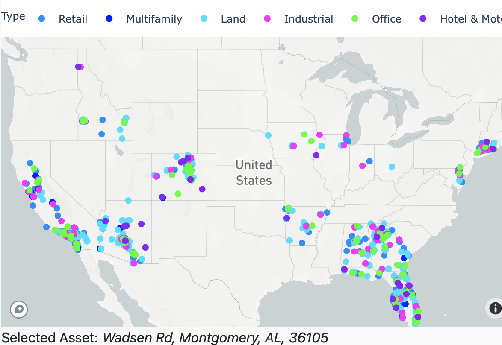
</p>

<p align="center">
Fig 1: Interactive Asset Map View
</p>

This view shows all assets for the selected portfolio on a map. It also acts as a controller for the asset level time series projects for the fundamental variables and the physical hazards. When hovering over a specific asset, the user can see the data attributes for the specific asset. The top bar displays the legend, indicating the color encoding of specific asset types.

#### Estimated Loss View

<p align="center">
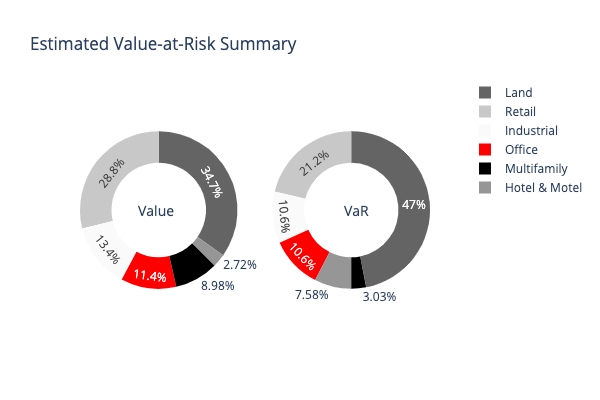
</p>

<p align="center">
Fig 2: Estimated Loss View
</p>

This view shows the distribution of asset value across different asset types in the portfolio and shows the associated loss distribution across asset types expressed as a percentage. By default, these distributions are based on forward looking scenarios. In cases where the dataset does not have an asset value associated with individual assets, all assets are by default assumed to have the same value. We provide the choice of switching from distribution by type (expressed as a percentage of the total portfolio) and estimated value at risk (in $M) through the radio button selector on the top of this view.

#### Cross Scenario Loss Summary

<p align="center">
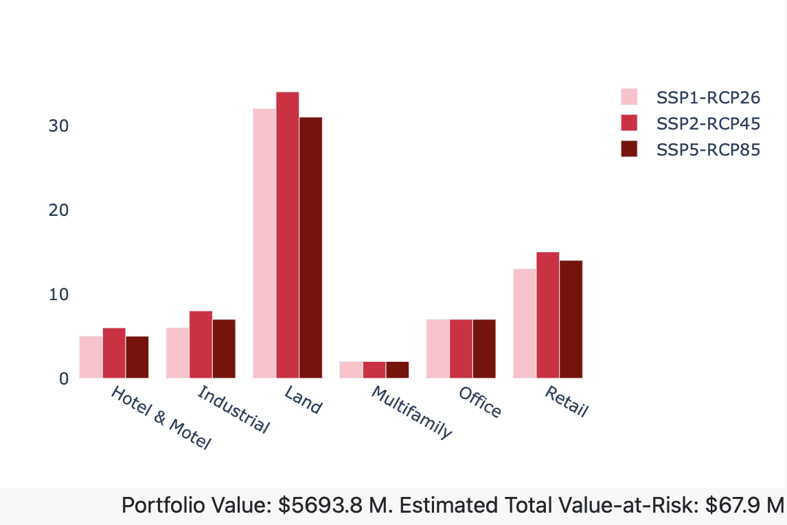
</p>

<p align="center">
Fig 3: Cross Scenario Loss Summary
</p>

This view can be accessed by selecting the radio button “Loss Across Scenarios”. This allows the user to explore the estimated loss across different types across multiple climate scenarios. We expect correlation between the SSPs and the estimated loss to be dependent on the geospatial distribution of the assets in the portfolio for each asset type.

#### Temperature and Precipitation Time Series View

<p align="center">
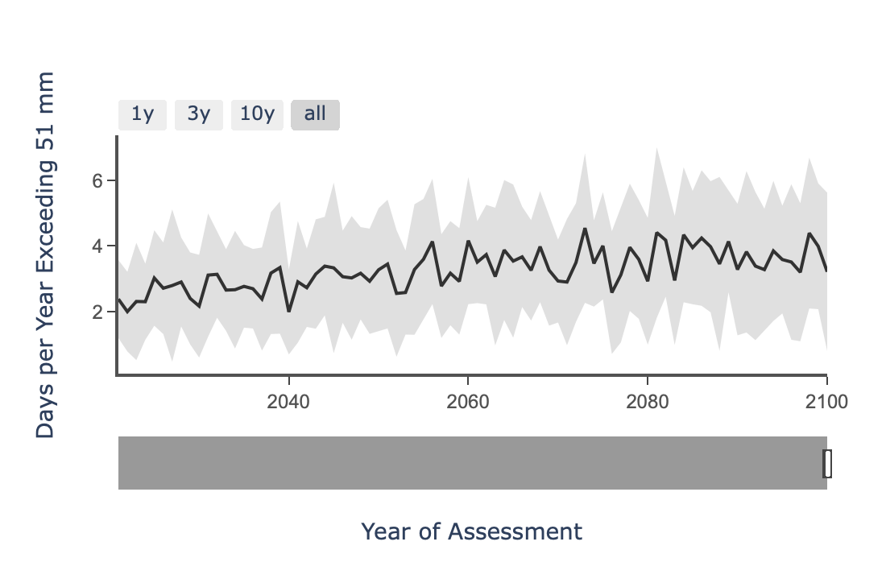
</p>

<p align="center">
Fig 4: Asset Time Series View
</p>

This time series view shows the projected fundamental variables over different selected scenarios. The user has a choice of annual temperature, annual precipitation, and extreme precipitation. When hovering, the user can see the value of the fundamental variable at a specific year for the selected scenario. The time series line indicates the mean value and the gray band indicates the tolerance of the forward looking projects, typically one standard deviation in the projected outputs of the collection of climate models used. Increased uncertainty from the climate models surface as wider tolerance bands for specific variables.

#### Historic Physical Hazard Severity Time Series View

<p align="center">
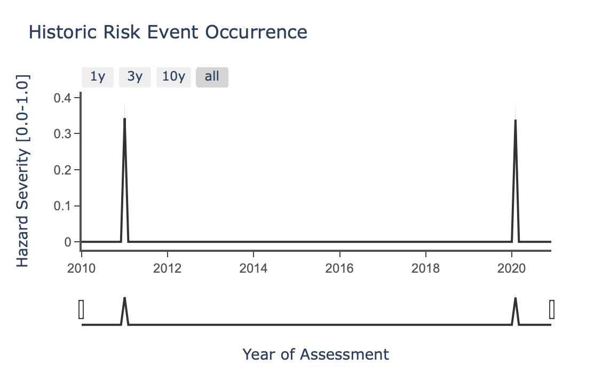
</p>

<p align="center">
Fig 5: Asset historic hazard severity time series view
</p>

This view illustrates the severity of historic exposure to fires, floods and cyclones at a monthly scale. By default, the range slider is set to the maximum time period of assessment, covering the 11 year window ranging from 2010 to 2020.

#### Forward Looking Physical Hazard Time Series View

<p align="center">
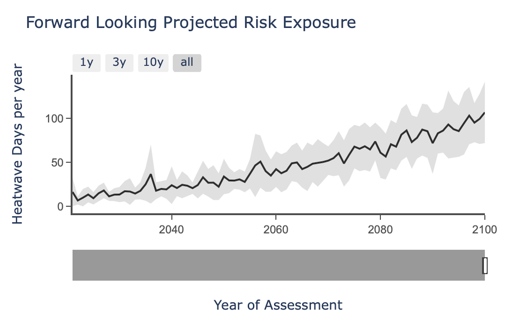
</p>

<p align="center">
Fig 6: Projected physical hazard time series view
</p>

This time series view shows the projected YoY hazard exposure at the specific asset location. The user has a choice of wildfire, drought, heatwaves, flooding, sea level rise, tropical cyclones, or water stress. When hovering, the user can see the value of the indicator at a specific year for the selected scenario. The time series line indicates the mean value and the gray band indicates the tolerance of the forward looking projects, typically one standard deviation in the projected outputs of the collection of climate models used. Increased uncertainty from the climate models surface as wider tolerance bands for specific variables. The range slider allows the user to see the time series over a specific range of years. By default, the range slider is set to the maximum time period of assessment, usually set to 2021-2100.

#### Risk Heat Map View

<p align="center">
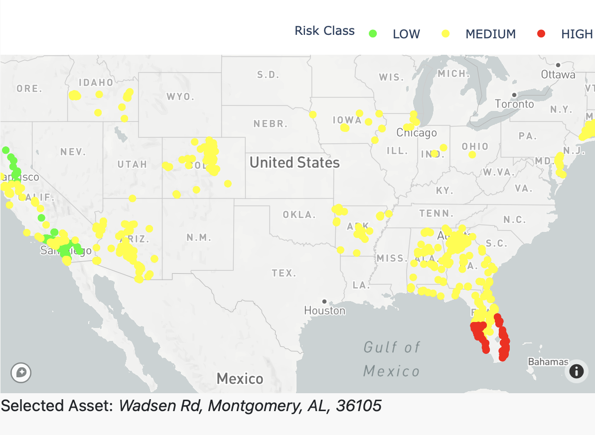
</p>

<p align="center">
Fig 7: Risk Heatmap View
</p>

This view shows the heatmap of forward looking risk for a selected physical hazard type. We project physical risk over the 30 year window between 2021 and 2050 and look at the maximum risk exposure to a specific hazard for an asset. We use the maximum risk exposure value to color code the asset to LOW (Green), MEDIUM (Yellow), or HIGH (Red) risk categories. [Climate Explorer QuickStart Guide](https://developers.sustglobal.com/explorer.html)

##### Methodology description
1. For a selected SSP, we would look at the maximum value of risk exposure over the 2021-2050 analysis time window for all hazards with the exception of sea level rise (SLR) and 2021-2100 for SLR as the input to the risk summary view. This is to account for sea level rise being a longer term hazard, having more profound exposure over the second half of the century.
2. For each hazard, we then identify the maximum risk exposure value of each asset over all the years in the analysis time window and use that value as input to a classification of LOW, MEDIUM or HIGH. Note that for drought (SPEI), we would use the negative of the value in the risk exposure datasets (negative drought (SPEI) values indicate risk). For flooding, we use the number of years within a 30-year period where the risk exceeds a preset threshold (5%). This is to simulate a flood exceedance threshold from the flood exposure values.

3. a) Asset price is set as $1M in the absence of values provided
b) Maximum exposure values per hazard are listed in the last table on the [Quickstart guide](./explorer.html).

A table of heat map coding ranges can be found on our [QuickStart Guide.](https://developers.sustglobal.com/explorer.html)


#### Summary Risk View

<p align="center">
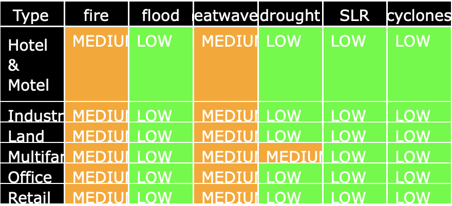
</p>

<p align="center">
Fig 8: Risk Summary Table
</p>

This view provides the summary of the forward looking risk exposure across different hazards for each of the asset types, providing a tabular view of the risk heat map for each of the different scenarios. The indicators are based on the average values of exposure across all assets of a specific type. Optionally on request, the indicators can be based on the maximum risk exposure value across all assets of a specific type. Optionally on request, this view can be provided for each of the assets rather than the asset types.

##### Methodology description

1. For a selected SSP, we would look at the maximum value of risk exposure over the 2021-2050 analysis time window for all hazards with the exception of sea level rise (SLR) and 2021-2100 for SLR as the input to the risk summary view.
2. For each hazard, we would look at the mean value per year over all the different assets for a certain asset type. This would give an average value of risk exposure across all types of assets for each year in the time window.
3. For each hazard, we would then pick the maximum risk exposure value of the mean value for each asset type over all the years in the analysis time window. We then use that value to determine the classification as LOW, MEDIUM or HIGH based on the value intervals listed below. Note that for drought (SPEI), we would use the negative of the value in the risk exposure datasets (negative drought (SPEI) values indicate risk). For flooding, we use the number of years within a decade where the risk exceeds a preset threshold (5%). This is to simulate a flood exceedance threshold from the flood exposure values.

#### Multi-hazard Heatmap View

<p align="center">
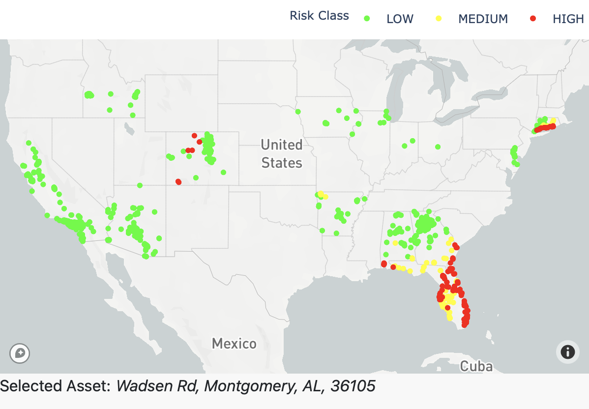
</p>

<p align="center">
Fig 9: Multi-hazard heatmap view
</p>

This view allows the user to see a consolidated view of risk exposure across all assets, across multiple hazards. We use fire, flood, sea level rise and cyclones to highlight risk exposures for each asset. For fire, flood, sea level rise and drought, we use the forward looking 30-year time horizon (2021-2050) by default or cyclones, we use the historic 11 year time horizon (2010-2020). When hovering over a specific asset, you can see the dominant risk type listed (Fig 10 below). The risks are normalized based on peak risk values of the risk exposure distribution.


#### Multi-hazard Time Series View

<p align="center">
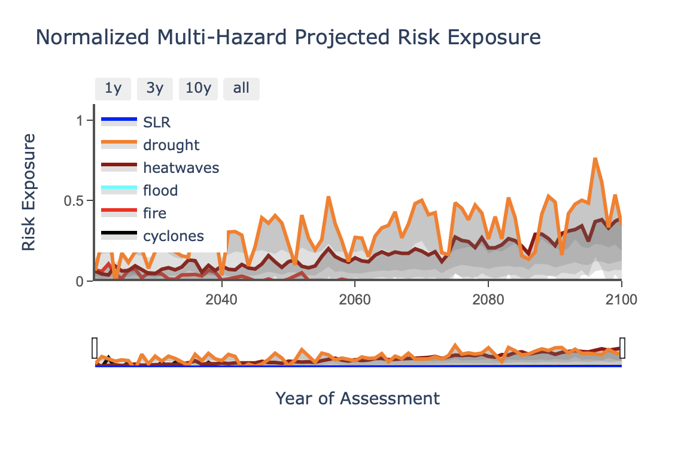
</p>

<p align="center">
Fig 10: Multi-hazard time series view
</p>

This view provides a normalized view of forward looking risk exposure of a specific selected asset in the multi-hazard heatmap view across all hazard types: fire, flood, sea level rise, heatwaves and drought, for the High Emissions climate scenario. For a specific highlighted asset, the user can explore the risk over the 2021-2100 time horizon through this interactive view.

#### Exporting Views from the Dashboard

<p align="center">
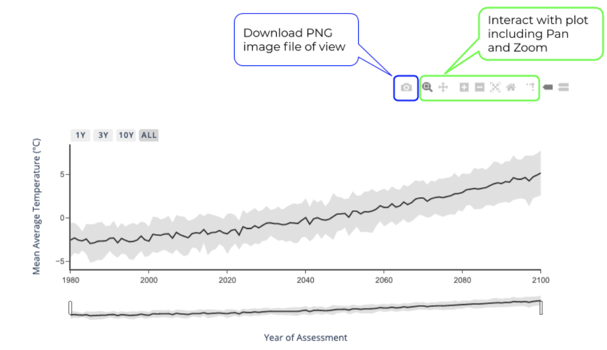
</p>

<p align="center">
Fig 11: Exporting Views
</p>

We offer interactive plots within our dashboard. Hover over the line graphs to read the values at specific time points or over the map to see details of the assets. To facilitate reporting, we offer the ability to export the current view as a PNG image file. We also allow the user to pan and zoom on the graphs and maps to explore and export views of the data as most suitable.

#### Graph Analysis Functionality

Within Climate Explorer, each graph allows for real-time configuration and analysis. On the top right of each graph, you can zoom-in and out, pan, and hover to configure your data in real-time.

[View a Plotly Tutorial on our built-in Graph Analysis functionality, here.](https://plotly.com/chart-studio-help/zoom-pan-hover-controls/)

## Dataset Description
The naming convention for the historic risk exposure is as follows:

```sustglobal_asset_his_risk_{dataset_name}.csv```

Here, each row corresponds to one asset location, and there are individual columns for each month from Jan 2010 to Dec 2020 for fire, flood and cyclone exposure.
The dataset used for climate scenario analysis can also be accessed in raw form in the CSV format. The naming convention for the CSV files is as follows:

```sustglobal_asset_fwd_{reporting_data_type}_risk_{dataset_name}_{scenarioID}. csv```

Here are the descriptions of the naming parameters:
1. Reporting Data Type {reporting_data_type}: This field has one of the following risk parameters: annual_temperature, annual_precipitation,
extreme_precipitation, fire, flood, heatwaves and drought(SPEI), sea level rise (SLR)
2. Dataset Name {dataset_name}: Name assigned to project or dataset by customer or Sust Global
3. Scenario ID {scenarioID} : Scenario ID which would be either: ssp126 (Strong Mitigation); ssp245 (Middle of the Road); or ssp585 (High Emissions)

In every dataset CSV, each row corresponds to an asset in the data collection. We have columns for the individual asset attributes and a column for each year from 1980 to 2100. The columns for each year contain the projected risk value for a specific asset for a specific year based on the reporting outcomes description.

## Disclaimer and Liability
1. **Disclaimer.** While Sust Global endeavors to ensure that the information, analysis and forecasts in the Analytics Platform are correct, Sust Global will not be liable for any errors, inaccuracies or delays in content, or for any actions taken in reliance thereon.
2. Sust Global does not guarantee the accuracy of or endorse the views or opinions given by any third party content provider.
3. The information contained in the User Guide and Climate Scenario Analysis Platform is provided without any conditions, warranties or other terms of any kind. Accordingly, and to the maximum extent permitted by law, the the Reference Guide and Climate Scenario Analysis Platform is provided on the basis that Sust Global excludes all representations, warranties, conditions and other terms (including, without limitation, the conditions implied by law of satisfactory quality, fitness for purpose and the use of reasonable care and skill) which but for this legal notice might have effect in relation to this service.
4. **Liability.** Sust Global excludes all liability and responsibility for any amount or kind of loss or damage that may result to users (whether a paid subscriber or not) or third parties (including without limitation, any direct, indirect, punitive or consequential loss or damages, or any loss of income, profits, goodwill, data, contracts, use of money, or loss or damages arising from or connected in any way to business interruption, and whether in tort (including without limitation negligence), contract or otherwise) in connection with the Brochure in any way or in connection with the use, inability to use or the results of use of the Brochure, any websites linked to the Brochure or the materials on such websites.
5. This exclusion of liability will include but not be limited to loss or damage due to viruses that may infect your computer equipment, software, data or other property on account of your access to or use of the Brochure or your downloading of any material from any websites linked to the Brochure.
6. **Governing Law and Jurisdiction:** This legal notice shall be governed by and construed in accordance with English law. Disputes arising in connection with this legal notice shall be subject to the exclusive jurisdiction of the English courts.

## Additional Reading
1. [Sust Global Developer Center](https://developers.sustglobal.com)
2. [Sust Global Open API specification](https://explorer.sustglobal.io/redoc/)
3. [Sust Global: Exploring Future Climate Scenarios](https://medium.datadriveninvestor.com/is-our-house-on-fire-98919692259c)
4. [Sust Global: Climate Risk Intelligence](https://medium.datadriveninvestor.com/it-matters-when-its-in-your-backyard-e3f93953e282)
5. [Explanation of Shared SocioEconomic Pathways](https://www.carbonbrief.org/explainer-how-shared-socioeconomic-pathways-explore-future-climate-change)
6. [Historic and Future Fires from Climate Models](https://www.sciencedirect.com/science/article/abs/pii/S0921818116303770?via%3Dihub)
7. [Exposure and Impact from River Flooding](https://www.nature.com/articles/s41558-018-0257-z?WT.feed_name=subjects_hydrology)
8. [About the SPEI index](https://spei.csic.es/home.html)
9. [Carbon Brief: How climate change is accelerating sea level rise](https://www.carbonbrief.org/explainer-how-climate-change-is-accelerating-sea-level-rise)
10. [Projected Future Changes in Tropical Cyclones](https://agupubs.onlinelibrary.wiley.com/doi/full/10.1029/2020GL088662)
